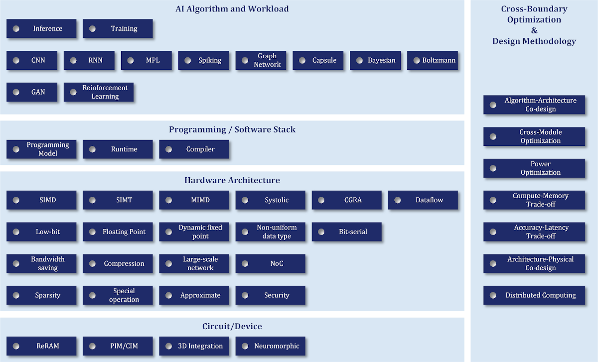

# AI Chip Paper List
## Table of Contents

 - [About This Project](#about-this-project)
 - [The Chronological Listing of Papers](#the-chronological-listing-of-papers)
   -    [ISCA](#ISCA)
   -    [ASPLOS](#ASPLOS)
   -    [MICRO](#MICRO)
   -    [HPCA](#HPCA)

## About This Project
​	This project aims to help engineers, researchers and students to easily find and learn the good thoughts and designs in AI-related fields, such as AI/ML/DL accelerators, chips, and systems, proposed in the top-tier architecture conferences (ISCA, MICRO, ASPLOS, HPCA),. We also try to give some hints to these papers by adding some tags or notes based on our understanding. 

​	This project is initiated by the Advanced Computer Architecture Lab (ACA Lab) in Shanghai Jiao Tong University in collaboration with Biren Research. We will extend to more sources gradually. Please let us know if you have any comments or willings to contribute.

## The Listing of Tags

We will use the following tags to annotate these papers.

​                               

## The Chronological Listing of Papers

 
We list all the papers we have collected. If it is linkable; it is linked to the summary/paper/slides of the paper. The links are still updating. 

## ISCA 
### 2019

| Tags                                                         | -    | Title                                                        | Authors                                                      | Affiliations                                                 |
| ------------------------------------------------------------ | ---- | ------------------------------------------------------------ | ------------------------------------------------------------ | ------------------------------------------------------------ |
| Inference, Dataflow                                          | 1    | 3D-based Video Recognition Acceleration by Leveraging Temporal Locality [paper](https://dl.acm.org/doi/pdf/10.1145/3307650.3322260?download=true) | Huixiang Chen; Tao Li | University of Florida                                        |
| Inference;  Quantum                                          | 2    | A Stochastic-Computing based Deep Learning Framework using Adiabatic Quantum-Flux-Parametron Superconducting Technology [paper](https://arxiv.org/pdf/1907.09077.pdf) | Ruizhe Cai; Ao Ren; Nobuyuki Yoshikawa; Yanzhi Wang          | Northeastern University                                      |
| Training;  RL; Distributed training                          | 3    | Accelerating Distributed Reinforcement Learning with In-Switch Computing [paper](http://jianh.web.engr.illinois.edu/papers/iswitch-isca2019.pdf)   [summary](Summarys/ISCA/Accelerating%20Distributed%20Reinforcement%20Learning%20with%20In-Switch%20Computing.md) | Youjie Li; Jian Huang                                        | UIUC                                                         |
| Training;  Sparsity                                          | 4    | Eager Pruning: Algorithm and Architecture Support for Fast Training of Deep Neural Networks  [paper](https://dl.acm.org/doi/pdf/10.1145/3307650.3322263?download=true)  [summary](Summarys/ISCA/Eager%20Pruning%20Algorithm%20and%20Architecture%20Support%20for%20Fast%20Training%20of%20Deep%20Neural%20Networks.md) | Jiaqi Zhang; Tao Li                                          | University of Florida                                        |
| Inference;  Sparsity; Bit-serial                             | 5    | Laconic Deep Learning Inference Acceleration  [paper](https://arxiv.org/abs/1805.04513)  [summary](Summarys/ISCA/Laconic%20Deep%20Learning%20Inference%20Acceleration.md) | Sayeh Sharify; Andreas Moshovos                              | University of Toronto                                        |
| Inference; Memory; bandwidth-saving; large-scale networks; compression | 6    | MnnFast: A Fast and Scalable System Architecture for Memory-Augmented Neural Networks  [paper](https://dl.acm.org/doi/pdf/10.1145/3307650.3322214?download=true)  [summary](Summarys/ISCA/MnnFast%20A%20Fast%20and%20Scalable%20System%20Architecture%20for%20Memory-Augmented%20Neural%20Network.md) | Hanhwi Jang; Jangwoo Kim                                     | POSTECH; Seoul National University                           |
| Inference;  ReRAM; Sparsity                                  | 7    | Sparse ReRAM Engine: Joint Exploration of Activation and Weight Sparsity in Compressed Neural Networks  [paper](https://dl.acm.org/doi/pdf/10.1145/3307650.3322271?download=true)  [summary](Summarys/ISCA/Sparse%20ReRAM%20Engine%20Joint%20Exploration%20of%20Activation%20and%20Weight%20Sparsity%20in%20Compressed%20Neural%20Networks.md) | Tzu-Hsien Yang                                               | National Taiwan University; Academia Sinica; Macronix International. |
| Infernce;  Redundant computing                               | 8    | TIE: Energy-efficient Tensor Train-based Inference Engine for Deep Neural Network  [paper](https://dl.acm.org/doi/pdf/10.1145/3307650.3322258)  [summary](Summarys/ISCA/TIE%20Energy-efficient%20Tensor%20Train-based%20Inference%20Engine%20for%20Deep%20Neural%20Network.md) | Chunhua Deng; Bo Yuan                                        | Rutgers University                                           |
| Training;  CNN; floating point                               | 9    | FloatPIM\_ in-memory acceleration of deep neural network training with high precision  [paper](https://dl.acm.org/doi/pdf/10.1145/3307650.3322237?download=true)  [summary](Summarys/ISCA/FloatPIM%20in-memory%20acceleration%20of%20deep%20neural%20network%20training%20with%20high%20precision.md) | Mohsen Imani; Tajana Rosing                                  | UC San Diego                                                 |
| Training;  Programming model                                 | 10   | Cambricon-F\_ machine learning computers with fractal von neumann architecture  [paper](https://dl.acm.org/doi/pdf/10.1145/3307650.3322226)  [summary](Summarys/ISCA/Cambricon-F%20Machine%20Learning%20Computers%20with%20Fractal%20von%20Neumann%20Architecture.md) | Yongwei Zhao; Yunji Chen                                     | ICT; Cambricon                                               |
 

### 2018

| Tags                                           | - | Title                                                                                                                                                                                                                                          | Authors                               | Affiliations                                                         |
|------------------------------------------------|----|------------------------------------------------------------------------------------------------------------------------------------------------------------------------------------------------------------------------------------------------|---------------------------------------|----------------------------------------------------------------------|
| Training;CNN; RNN                              | 1  | A Configurable Cloud-Scale DNN Processor for Real-Time AI  [paper](https://www.microsoft.com/en-us/research/uploads/prod/2018/06/ISCA18-Brainwave-CameraReady.pdf)  [summary](Summarys/ISCA/A%20Configurable%20Cloud-Scale%20DNN%20Processor%20for%20Real-Time%20AI.md) | Jeremy Fowers; Doug Burger            | Microsoft                                                            |
| Inference; ReRAM                               | 2  | PROMISE: An End-to-End Design of a Programmable Mixed-Signal Accelerator for Machine- Learning Algorithms [paper](https://par.nsf.gov/servlets/purl/10078085)                                    | Prakalp Srivastava; Mingu Kang        | University of Illinois at Urbana-Champaign; IBM                     |
| Inference; Dataflow               | 3  | Computation Reuse in DNNs by Exploiting Input Similarity [paper]()  [slides](https://pdfs.semanticscholar.org/6416/fcd79b96808bdce58fb9e7d7b60d2683a552.pdf)                                                                             | Marc Riera; Antonio Gonza ?lez        | Universitat Polite ?cnica de Catalunya                               |
| Spiking                                 | 5  | Flexon: A Flexible Digital Neuron for Efficient Spiking Neural Network Simulations [paper](https://dl.acm.org/doi/pdf/10.1109/ISCA.2018.00032?download=true)   [slides](https://iscaconf.org/isca2018/slides/4A1.pdf)                      | Dayeol Lee; Jangwoo Kim               | Seoul National University; University of California                  |
| Space-time computing                       | 6  | Space-Time Algebra: A Model for Neocortical Computation [paper]()   [slides](https://iscaconf.org/isca2018/slides/4A2.pdf)                                                                                                           | James E. Smith                       | University of Wisconsin-Madison                                     |
| Inference; Cross-module optimization                             | 8  | RANA: Towards Efficient Neural Acceleration with Refresh-Optimized Embedded DRAM  [paper]()  [summary](Summarys/ISCA/RANA%20Towards%20Efficient%20Neural%20Acceleration%20with%20Refresh-Optimized%20Embedded%20DRAM%20.md) | Fengbin Tu; Shaojun Wei               | Tsinghua University                                                  |
| Inference;Datapath: bit-serial                | 9  | Neural Cache: Bit-Serial In-Cache Acceleration of Deep Neural Networks [paper](http://blaauw.engin.umich.edu/wp-content/uploads/sites/342/2019/10/Neural-Cache_-Bit-Serial-In-Cache-Acceleration-of-Deep-Neural-Networks.pdf)            | Charles Eckert; Reetuparna Das        | University of Michigan; Intel Corporation                            |
| Inference;Cross-module optimization       | 11 | EVA2: Exploiting Temporal Redundancy in Live Computer Vision [paper](https://capra.cs.cornell.edu/pubs/eva2-isca2018.pdf)   [slides](https://iscaconf.org/isca2018/slides/7A2.pdf)                                                         | Mark Buckler; Adrian Sampson          | Cornell University                                                   |
| Inference;CNN; Cross-module optimization; Power optimization | 12 | Euphrates: Algorithm-SoC Co-Design for Low-Power Mobile Continuous Vision  [paper]https://arxiv.org/abs/1803.11232)    [slides](http://ziyang.eecs.umich.edu/iesr/lectures/zhu18apr-present.pdf)    [summary](Summarys/ISCA/Euphrates%20Algorithm-SoC%20Co-Design%20for%20Low-Power%20Mobile%20Continuous%20Vision.md) | Yuhao Zhu; Paul Whatmough             | University of Rochetster; ARM Research                               |
| Inference;GAN; Sparsity; MIMD; SIMD       | 13 | GANAX: A Unified MIMD-SIMD Acceleration for Generative Adversarial Networks  [paper](https://arxiv.org/abs/1806.01107)  [summary](Summarys/ISCA/GANAX%20A%20Unified%20MIMD-SIMD%20Acceleration%20for%20Generative%20Adversarial%20Networks.md) | Amir Yazdanbakhsh; Hadi Esmaeilzadeh  | Georgia Institute of Technology; UC San Diego; Qualcomm Technologies |
| Inference;  CNN; Approximate                   | 14 | SnaPEA: Predictive Early Activation for Reducing Computation in Deep Convolutional Neural Networks  [paper](http://cseweb.ucsd.edu/~vakhlagh/ISCA18-SnaPEA.pdf)  [summary](Summarys/ISCA/SnaPEA%20Predictive%20Early%20Activation%20for%20Reducing%20Computation%20in%20Deep%20Convolutional%20Neural%20Networks.md) | Vahideh Akhlaghi; Hadi Esmaeilzadeh   | Georgia Institute of Technology; UC San Diego; Qualcomm .           |
| Inference;CNN; Sparsity;                       | 15 | UCNN: Exploiting Computational Reuse in Deep Neural Networks via Weight Repetition  [paper](https://arxiv.org/pdf/1804.06508.pdf)  [summary](Summarys/ISCA/UCNN%20Exploiting%20Computational%20Reuse%20in%20Deep%20Neural%20Networks%20via%20Weight%20Repetition.md) | Kartik Hegde; Christopher W. Fletche | University of Illinois at Urbana-Champaign;  NVIDIA                 |
| Inference; Non-uniform | 16 | Energy-Efficient Neural Network Accelerator Based on Outlier-Aware Low-Precision Computation  [paper](https://ieeexplore.ieee.org/document/8416865)  [summary](Summarys/ISCA/Energy-efficient%20Neural%20Network%20Accelerator%20Based%20on%20Outlier-aware%20Low-precision%20Computation.md) | Eunhyeok Park; Sungjoo Yoo            | Seoul National University                                            |
| Inference; Dataflow: Dynamic                   | 17 | Prediction Based Execution on Deep Neural Networks [paper](https://mingcong.github.io/static/papers/Prediction_AI.pdf)                                                                                                                     | Mingcong Song; Tao Li                 | University of Flirida                                                |
| Inference;  Datapath: bit-serial              | 18 | Bit Fusion: Bit-Level Dynamically Composable Architecture for Accelerating Deep Neural Network [paper](https://arxiv.org/pdf/1712.01507)                                                                                               | Hardik Sharma; Hadi Esmaeilzadeh      | Georgia Institute of Technology; University of California            |
| Training;  memory: bandwith-saving            | 19 | Gist: Efficient Data Encoding for Deep Neural Network Training [paper](https://www.microsoft.com/en-us/research/uploads/prod/2018/04/fiddle-gist-isca18.pdf)                                                                               | Animesh Jain; Gennady Pekhimenko      | Microsoft Research; University of Toronto; Univerity of Michigan     |
| Inference;  Cross-module optimization     | 20 | The Dark Side of DNN Pruning [paper](http://personals.ac.upc.edu/ryazdani/The_Dark_Side_of_DNN_Pruning.pdf)                                                                                                                                | Reza Yazdani; Antonio Gonza ?lez      | Universitat Polite ?cnica de Catalunya                               |
 

### 2017

| Tags                                   | -    | Title                                                        | Authors                                  | Affiliations                                                 |
| -------------------------------------- | ---- | ------------------------------------------------------------ | ---------------------------------------- | ------------------------------------------------------------ |
| Inference                              | 1    | In-Datacenter Performance Analysis of a Tensor Processing Unit [paper](https://arxiv.org/pdf/1704.04760) | Norman P. Jouppi                         | Google                                                       |
| Inference; Dataflow                    | 2    | Maximizing CNN Accelerator Efficiency Through Resource Partitioning [paper](http://compas.cs.stonybrook.edu/~mferdman/downloads.php/ISCA17_Maximizing_CNN_Accelerator_Efficiency_Through_Resource_Partitioning.pdf) | Yongming Shen                            | Stony Brook University                                       |
| Training                               | 3    | SCALEDEEP: A Scalable Compute Architecture for Learning and Evaluating Deep Networks [paper](https://arxiv.org/pdf/1803.04783) | Swagath Venkataramani; Anand Raghunathan | Purdue University; Parallel Computing Lab; Intel Corporation |
| Inference; Algorithm-architecture-codesign | 4    | Scalpel: Customizing DNN Pruning to the Underlying Hardware Parallelism [paper](http://homes.sice.indiana.edu/lukefahr/papers/jiecaoyu_isca17.pdf) | Jiecao Yu; Scott Mahlke                  | University of Michigan; ARM                                  |
| Inference; Sparsity                    | 5    | SCNN: An Accelerator for Compressed-sparse Convolutional Neural Networks [paper](https://arxiv.org/pdf/1708.04485)    [summary](Summarys/ISCA/SCNN%20An%20Accelerator%20for%20Compressed-sparse%20Convolutional%20Neural%20Networks.md) | Angshuman Parashar; William J. Dally     | NVIDIA; MIT; UC-Berkeley; Stanford University                |
| Training; Low-bit                      | 7    | Understanding and Optimizing Asynchronous Low-Precision Stochastic Gradient Descent [paper](http://dawn.cs.stanford.edu/pubs/sgd-isca2017.pdf) | Christopher De Sa; Kunle Olukotun        | Stanford University                                          |
 

### 2016
| Tags                                        | - | Title                                                                                                                                                                                                                      | Authors                              | Affiliations                                          |
|---------------------------------------------|----|----------------------------------------------------------------------------------------------------------------------------------------------------------------------------------------------------------------------------|--------------------------------------|-------------------------------------------------------|
| Inference;Sparsity             | 1  | Cnvlutin: Ineffectual-Neuron-Free Deep Neural Network Computing  [paper](http://www.eecg.toronto.edu/~enright/albericio-isca2016.pdf)   [summary](Summarys/ISCA/Cnvlutin%20Ineffectual-Neuron-Free%20Deep%20Neural%20Network%20Computing%20.md) | Jorge Albericio; Tayler Hetheringto  | University of Toronto; University of British Columbia |
| Inference; Analog                           | 2  | ISAAC: A Convolutional Neural Network Accelerator with In-Situ Analog Arithmetic in Crossbars [paper](https://www.cs.utah.edu/~rajeev/pubs/isca16.pdf)                                                                | Ali Shafiee; Vivek Srikumar          | University of Utah，Hewlett Packard Labs               |
| Inference; PIM                              | 3  | PRIME: A Novel Processing-in-Memory Architecture for Neural Network Computation in ReRAM-Based Main Memory [paper](https://seal.ece.ucsb.edu/sites/default/files/publications/prime_isca_2016.pdf)                  | Ping Chi; Yuan Xie                   | University of California                              |
| Inference; Sparsity                         | 4  | EIE: Efficient Inference Engine on Compressed Deep Neural Network [paper](https://www.cs.virginia.edu/~smk9u/CS6501F16/p243-han.pdf)                                                                                   | Song Han; William J. Dally          | Stanford University; NVIDIA                           |
| Inference; Analog                           | 5  | RedEye: Analog ConvNet Image Sensor Architecture for Continuous Mobile [paper](https://meteor.ame.asu.edu/papers/likamwa2016redeye-isca.pdf)                                                                           | Robert LiKamWa; Lin Zhong            | Rice University                                       |
| Inference; Architecture-Physical-Co-design | 6  | Minerva: Enabling Low-Power; Highly-Accurate Deep Neural Network Accelerators  [paper](http://people.seas.harvard.edu/~reagen/papers/minerva-isca2016.pdf)   [summary](Summarys/ISCA/Minerva%20Enabling%20Low-Power,%20Highly-Accurate%20Deep%20Neural%20Network%20Accelerators%20.md) | Brandon Reagen; David Brooks         | Harvard University                                    |
| Inference; Dataflow                         | 7  | Eyeriss: A Spatial Architecture for Energy-Efficient Dataflow for Convolutional Neural Networks [paper](https://people.csail.mit.edu/emer/papers/2016.06.isca.eyeriss_architecture.pdf)                               | Yu-Hsin Chen; Vivienne Sze          | MIT; NVIDIA                                           |
| Inference; 3D integration                   | 8  | Neurocube: A Programmable Digital Neuromorphic Architecture with High-Density 3D Memory  [paper](http://www.iscaconf.org/isca2016/wp-content/uploads/2016/07/6-2.pdf)    [summary](Summarys/ISCA/Neurocube%20A%20Programmable%20Digital%20Neuromorphic%20Architecture%20with%20High-Density%203D%20Memory.md) | Duckhwan Kim; Saibal Mukhopadhyay    | Georgia Institute of Technology                       |
| Inference                                   | 9  | Cambricon: An Instruction Set Architecture for Neural Networks  [paper](https://seal.ece.ucsb.edu/sites/seal.ece.ucsb.edu/files/publications/07551409.pdf)   [summary](Summarys/ISCA/Cambricon%20An%20Instruction%20Set%20Architecture%20for%20Neural%20Networks.md) | Shaoli Liu; Tianshi Chen             | CAS; Cambricon Ltd.                                  |
 

### 2015
| Tags                          | -    | Title                                                        | Authors   | Affiliations |
| ----------------------------- | ---- | ------------------------------------------------------------ | --------- | ------------ |
| Inference; Cross-module optimization | 1    | ShiDianNao: Shifting Vision Processing Closer to the Sensor [paper](https://www.epfl.ch/labs/lap/wp-content/uploads/2018/05/DuJun15_ShiDianNaoShiftingVisionProcessingCloserToTheSensor_ISCA15.pdf)    [summary](Summarys/ISCA/ShiDianNao%20Shifting%20Vision%20Processing%20Closer%20to%20the%20Sensor.md) | Zidong Du | ICT          |
 

## ASPLOS
### 2020
| Tags | - | Title                                                                                                                                         | Authors | Affiliations                                    |
|------|----|-----------------------------------------------------------------------------------------------------------------------------------------------|---------|-------------------------------------------------|
| Inference; Privacy; noise distribution |    | Shredder: Learning Noise Distributions to Protect Inference Privacy. [paper](https://arxiv.org/pdf/1905.11814)                 |         Fatemehsadat Mireshghallah; Mohammadkazem  Taram; et.al. | UCSD                                            |
| Arch.; Security; adversarial attack |    | DNNGuard: An Elastic Heterogeneous DNN Accelerator Architecture against Adversarial Attacks. [paper](http://alchem.usc.edu/portal/static/download/dnnguard.pdf) | Xingbin Wang; Rui Hou; Boyan Zhao; et.al.        | CAS; USC                                        |
| Accelerator;  Halide; loop transformation |    | Interstellar: Using Halide’s Scheduling Language to Analyze DNN Accelerators. [paper](https://dl.acm.org/doi/pdf/10.1145/3373376.3378514) | Xuan Yang; Mark Horowitz; et.al.        | Stanford; THU                                   |
| Arch.; model security; |    | DeepSniffer: A DNN Model Extraction Framework Based on Learning Architectural Hints. [paper](https://seal.ece.ucsb.edu/sites/default/files/publications/clean_project_asplos_cr_xing_3.pdf)  [codes](https://github.com/xinghu7788/DeepSniffer) | Xing Hu; Yuan Xie; et.al.        | UCSB                                            |
| Training; distributed; heterogeneity-aware |    | Prague: High-Performance Heterogeneity-Aware Asynchronous Decentralized Training. [paper](https://dl.acm.org/doi/pdf/10.1145/3373376.3378499?download=true) |         Qinyi Luo; Jiaao He; Youwei Zhuo; Xuehai Qian | USC                                             |
| Mobile; model compression |    | PatDNN: Achieving Real-Time DNN Execution on Mobile Devices with Pattern-based Weight Pruning. [paper](https://arxiv.org/pdf/2001.00138.pdf) | Wei Niu; Xiaolong Ma; Sheng Lin; et.al.        | College of William and Mary; Northeastern ; USC |
| Memory management; tensor computation; GPU |    | Capuchin: Tensor-based GPU Memory Management for Deep Learning. [paper](https://dl.acm.org/doi/pdf/10.1145/3373376.3378505?download=true) |         Xuan Peng; Xuanhua Shi; Hulin Dai; et.al.| HUST; MSRA; USC                                 |
| NPU; memory management |    | NeuMMU: Architectural Support for Efficient Address Translations in Neural Processing Units. [paper](https://arxiv.org/pdf/1911.06859) | Bongjoon Hyun; Youngeun Kwon; Yujeong  Choi; et.al.         | KAIST                                           |
| tensor computation auto-optimization; design space; |    | FlexTensor: An Automatic Schedule Exploration and Optimization Framework for Tensor Computation on Heterogeneous System. [paper](https://dl.acm.org/doi/pdf/10.1145/3373376.3378505?download=true)  [codes](https://github.com/KnowingNothing/FlexTensor) | Size Zheng; Yun Liang; Shuo Wang; et.al.        | PKU                                             |
 

### 2019
| Tags | - | Title                                                                                                                                  | Authors | Affiliations                               |
|------|----|----------------------------------------------------------------------------------------------------------------------------------------|---------|--------------------------------------------|
| RL, |    | FA3C: FPGA-Accelerated Deep Reinforcement Learning. [paper](https://dl.acm.org/doi/pdf/10.1145/3297858.3304058?download=true) |         Hyungmin Cho; Pyeongseok Oh; Jiyoung Park; et.al.| Hongik University; SNU                     |
| Inference,   ReRAM |    | PUMA: A Programmable Ultra-efficient Memristor-based Accelerator for Machine Learning Inference. [paper](https://arxiv.org/pdf/1901.10351.pdf) |         Aayush Ankit; Dejan S Milojičić; et.al.| Purdue; UIUC; HP                           |
| Inference, ReRAM |    | FPSA: A Full System Stack Solution for Reconfigurable ReRAM-based NN Accelerator Architecture. [paper](https://seal.ece.ucsb.edu/sites/default/files/publications/1901.09904.pdf) |   Yu Ji; Yuan Xie; et.al.      | THU; UCSB                                  |
| Inference, Bit-serial |    | Bit-Tactical: A Software/Hardware Approach to Exploiting Value and Bit Sparsity in Neural Networks. [paper](http://www.eecg.toronto.edu/~mostafam/files/TCL_ASPLOS2019.pdf) | Alberto Delmas Lascorz; Andreas Ioannis Moshovos; et.al.         | Toronto; NVIDIA                            |
| Inference, Dataflow |    | TANGRAM: Optimized Coarse-Grained Dataflow for Scalable NN Accelerators. [paper](https://web.stanford.edu/~mgao12/pubs/tangram.asplos19.pdf)  [codes](https://github.com/stanford-mast/nn_dataflow) | Mingyu Gao; Xuan Yang; Jing Pu; et.al.         | Stanford                                   |
| Inference, CNN, Systolic, Sparsity |    | Packing Sparse Convolutional Neural Networks for Efficient Systolic Array Implementations: Column Combining Under Joint Optimization. [paper](http://www.eecs.harvard.edu/~htk/publication/2019-asplos-kung-mcdanel-zhang.pdf)  [codes](https://github.com/BradMcDanel/column-combine) |   Hsiangtsung Kung;Bradley McDanel; Saiqian Zhang      | Harvard                                    |
| Training, CNN, Distributed computing |    | Split-CNN: Splitting Window-based Operations in Convolutional Neural Networks for Memory System Optimization. [paper](https://dl.acm.org/doi/pdf/10.1145/3297858.3304038?download=true) |  Tian Jin; Seokin Hong       | IBM; Kyungpook National University         |
| Training, Distributed computing |    | HOP: Heterogeneity-Aware Decentralized Training. [paper](http://alchem.usc.edu/~qinyi/download/hop.pdf)                          |  Qinyi Luo; Jinkun Lin; Youwei Zhuo; Xuehai Qian       | USC; THU                                   |
| Training, Compiler |    | Astra: Exploiting Predictability to Optimize Deep Learning. [paper](https://www.microsoft.com/en-us/research/uploads/prod/2019/02/astra-asplos19.pdf) | Muthian Sivathanu; Tapan Chugh; Sanjay S Singapuram; Lidong Zhou        | Microsoft                                  |
| Training, Quantization, Compression |    | ADMM-NN: An Algorithm-Hardware Co-Design Framework of DNNs Using Alternating Direction Methods of Multipliers. [paper](http://alchem.usc.edu/portal/static/download/admmnn.pdf) |         Ao Ren; Tianyun Zhang; Shaokai Ye; et.al.| Northeastern; Syracuse; SUNY; Buffalo; USC |
| Security |    | DeepSigns: An End-to-End Watermarking Framework for Protecting the Ownership of Deep Neural Networks. [paper](https://www.microsoft.com/en-us/research/uploads/prod/2018/11/2019ASPLOS_Final_DeepSigns.pdf) | Bita Darvish Rouhani; Huili Chen; Farinaz Koushanfar        | UCSD                                       |
 

### 2018
| Tags | - | Title                                                                                                  | Authors | Affiliations                              |
|------|----|--------------------------------------------------------------------------------------------------------|---------|-------------------------------------------|
| Compiler |    | Bridging the Gap Between Neural Networks and Neuromorphic Hardware with A Neural Network Compiler. [paper](https://arxiv.org/pdf/1801.00746) [slides](https://drive.google.com/open?id=1yU_xyeormi5UhR0vHcFGRWpaCDQTvAJp) | Yu Ji; Youhui Zhang; Wenguang Chen; Yuan Xie         | Tsinghua; UCSB                            |
| Inference, Dataflow, NoC |    | MAERI: Enabling Flexible Dataflow Mapping over DNN Accelerators via Reconfigurable Interconnects. [paper](https://anands09.github.io/papers/maeri_asplos2018.pdf) [slides](https://drive.google.com/open?id=1ac-hg0rWhB3Z71jJTbTDkHVVlfg6n5BX) | Hyoukjun Kwon; Ananda  Samajdar; Tushar  Krishna        | Georgia Tech                              |
| Bayesian |    | VIBNN: Hardware Acceleration of Bayesian Neural Networks. [paper](https://arxiv.org/pdf/1802.00822) | Ruizhe Cai; Ao  Ren; Ning  Liu; et.al.        | Syracuse University; USC                  |
 

### 2017
| Tags | - | Title                                                                                     | Authors | Affiliations                                           |
|------|----|-------------------------------------------------------------------------------------------|---------|--------------------------------------------------------|
| Dataflow, 3D Integration |    | Tetris: Scalable and Efficient Neural Network Acceleration with 3D Memory. [paper](https://web.stanford.edu/~mgao12/pubs/tetris.asplos17.pdf) |         Mingyu Gao; Jing Pu; Xuan Yang; et.al.| Stanford University                                    |
| Space-time computing |    | SC-DCNN: Highly-Scalable Deep Convolutional Neural Network using Stochastic Computing. [paper](http://alchem.usc.edu/portal/static/download/sc_dcnn.pdf) |         Ao Ren; Zhe  Li; Caiwen  Ding; et.al.| Syracuse University; USC; The City College of New York |
 

### 2015
| Tags | - | Title                                                  | Authors | Affiliations     |
|------|----|--------------------------------------------------------|---------|------------------|
| Inference |    | PuDianNao: A Polyvalent Machine Learning Accelerator. [paper](https://dl.acm.org/doi/10.1145/2694344.2694358) | Daofu Liu; Tianshi  Chen; Shaoli  Liu; et.al.        | CAS; USTC; Inria |
 

### 2014
| Tags | - | Title                                                                                       | Authors | Affiliations |
|------|----|---------------------------------------------------------------------------------------------|---------|--------------|
| Inference |    | DianNao: A Small-Footprint High-Throughput Accelerator for Ubiquitous Machine-Learning. [paper](http://novel.ict.ac.cn/ychen/pdf/DianNao.pdf) |  Tianshi Chen; Zidong Du; Ninghui Sun; et.al.       | CAS; Inria   |
 

## MICRO
### 2019
| Tags | - | Title                                                                                                                                                             | Authors | Affiliations         |
|------|----|-------------------------------------------------------------------------------------------------------------------------------------------------------------------|---------|----------------------|
| accelerator; arch.; distributed memory |    | Wire-Aware Architecture and Dataflow for CNN Accelerators. [paper](https://www.cs.utah.edu/~rajeev/pubs/micro19b.pdf)                                       | Sumanth Gudaparthi; Surya Narayanan; Rajeev Balasubramonian ; Edouard Giacomin ;  Hari Kambalasubramanyam; Pierre-Emmanuel Gaillardon | Utah                 |
| adversarial attack; object detection |    | ShapeShifter: Enabling Fine-Grain Data Width Adaptation in Deep Learning. [paper](https://arxiv.org/pdf/1804.05810)                                         | Shang-Tse Chen； Cory Cornelius； Jason Martin； Duen Horng Chau | Georgia tech; intel |
| Inference; Arch.; multi-chip |    | Simba: Scaling Deep-Learning Inference with Multi-Chip-Module-Based Architecture. [paper](https://people.eecs.berkeley.edu/~ysshao/assets/papers/shao2019-micro.pdf)   [slides](https://people.eecs.berkeley.edu/~ysshao/assets/talks/shao2019-micro-slides.pdf) | Yakun Sophia Shao;Jason Clemons;  Rangharajan Venkatesan; et. al. | NVIDIA               |
| zero value compression;  ISA; cross layer |    | ZCOMP: Reducing DNN Cross-Layer Memory Footprint Using Vector Extensions. [paper](https://dl.acm.org/doi/pdf/10.1145/3352460.3358305)                       | Berkin Akin; Zeshan A. Chishti; Alaa R. Alameldeen | Google; Intel        |
| co-design; dynamic optimization |    | Boosting the Performance of CNN Accelerators with Dynamic Fine-Grained Channel Gating. [paper](http://www.csl.cornell.edu/~zhiruz/pdfs/cgnet-micro2019.pdf) | Weizhe Hua; Yuan Zhou; Christopher De Sa; et.al. | Cornell              |
| accelerator; sparse; tensor |    | SparTen: A Sparse Tensor Accelerator for Convolutional Neural Networks. [paper](https://dl.acm.org/doi/pdf/10.1145/3352460.3358291?download=true)            | Ashish Gondimalla; Noah Chesnu; Noah Chesnu; et.al. | Purdue               |
| energy efficiency; error tolerance; memory; |    | EDEN: Enabling Approximate DRAM for DNN Inference using Error-Resilient Neural Networks. [paper](https://people.inf.ethz.ch/omutlu/pub/EDEN-efficient-DNN-inference-with-approximate-memory_micro19.pdf) | Skanda Koppula; Lois Orosa;  A. Giray Yağlıkçı; et.al. | ETHZ            |
| inference; CNN; hardware |    | eCNN: a Block-Based and Highly-Parallel CNN Accelerator for Edge Inference. [paper](https://arxiv.org/pdf/1910.05680)                                      | Chao-Tsung Huang; Yu-Chun Ding;Huan-Ching Wang; et. al. | NTHU                 |
| co-design; memory; tensor |    | TensorDIMM: A Practical Near-Memory Processing Architecture for Embeddings and Tensor Operations in Deep Learning. [paper](https://arxiv.org/pdf/1908.03072) | Youngeun Kwon; Yunjae Lee; Minsoo Rhu | KAIST                |
| performance; cost model; dataflow |    | Understanding Reuse; Performance; and Hardware Cost of DNN Dataflows: A Data-Centric Approach. [paper](https://arxiv.org/pdf/1805.02566)                    | Hyoukjun Kwon; Prasanth Chatarasi; Michael Pellauer; et.al. | Georgia Tech; NVIDIA |
| co-design; sparse; inference; |    | MaxNVM: Maximizing DNN Storage Density and Inference Efficiency with Sparse Encoding and Error Mitigation. [paper](http://nvmw.ucsd.edu/nvmw2020-program/unzip/current2/nvmw2020-final14.pdf) | Lillian Pentecost, Marco Donato, Brandon Reagen; et.al. | Harvard; Facebook    |
| RNN; bitwise; fuzzy |    | Neuron-Level Fuzzy Memoization in RNNs. [paper](https://upcommons.upc.edu/bitstream/handle/2117/176878/MICRO2019.pdf)                                       | Franyell Silfa;Gem Dot; Jose-Maria Arnau; et.al. | UPC                  |
| accelerator; inference; co-design; memory; |    | Manna: An Accelerator for Memory-Augmented Neural Networks. [paper](https://dl.acm.org/doi/pdf/10.1145/3352460.3358304?download=true)                       | Jacob R. Stevens; Ashish Ranjan; Dipankar Das; et.al. | Purdue; Intel        |
| automata processing; in memory; accelerator |    | eAP: A Scalable and Efficient In-Memory Accelerator for Automata Processing. [paper](http://www.cs.virginia.edu/~es9bt/papers/eAP_MICRO19.pdf)              | Elaheh Sadredini; Reza Rahimi; Vaibhav Verma;et.al. | Virginia             |
| Sparse; tensor; accelerator |    | ExTensor: An Accelerator for Sparse Tensor Algebra. [paper](https://www.kartikhegde.net/files/ExTensor_final.pdf)                                            | Kartik Hegde; Hadi Asghari-Moghaddam; Michael Pellauer | UIUC; NVIDIA         |
| Matrix-vector; sparse; co-design; arch. |    | Efficient SpMV Operation for Large and Highly Sparse Matrices Using Scalable Multi-Way Merge Parallelization.. [paper](http://users.ece.cmu.edu/~franzf/papers/MICRO2019.pdf) | Fazle Sadi; Joe Sweeney; Tze Meng Low; et.al. | CMU                  |
| sparse; co-design; pruning |    | Sparse Tensor Core: Algorithm and Hardware Co-Design for Vector-wise Sparse Neural Networks on Modern GPUs. [paper](https://dl.acm.org/doi/pdf/10.1145/3352460.3358269?download=true) | Maohua Zhu; Tao Zhang; Tao Zhang; Yuan Xie | UCSB; Alibaba        |
| stereo vision; accelerator; constrained optimization |    | ASV: Accelerated Stereo Vision System. [paper](https://www.cs.rochester.edu/horizon/pubs/micro19-tigris.pdf)  [codes1](https://github.com/horizon-research/ism-algorithm)   [codes2](https://github.com/horizon-research/systolic-array-dataflow-optimizer) | Yu Feng; Paul Whatmough; Yuhao Zhu | Rochester            |
| co-design; accelerator; graph scheduling |    | Alleviating Irregularity in Graph Analytics Acceleration: a Hardware/Software Co-Design Approach. [paper](https://web.ece.ucsb.edu/~iakgun/files/MICRO2019.pdf) | Mingyu Yan;Xing Hu; Shuangchen Li; et.al. | UCSB; ICT            |
 

### 2018
| Tags | - | Title                                                                                                         | Authors | Affiliations                                              |
|------|----|---------------------------------------------------------------------------------------------------------------|---------|-----------------------------------------------------------|
| Sparsity; |    | Cambricon-s: Addressing Irregularity in Sparse Neural Networks: A Cooperative Software/Hardware Approach. [paper](https://dl.acm.org/doi/pdf/10.1109/MICRO.2018.00011?download=true) | Xuda Zhou ; Zidong Du ; Qi Guo ; Shaoli Liu ; Chengsi Liu ; Chao Wang ; Xuehai Zhou ; Ling Li ; Tianshi Chen ; Yunji Chen        | USTC; CAS                                                 |
| Inference; CNN; spatial correlation |    | Diffy: a Deja vu-Free Differential Deep Neural Network Accelerator. [paper](http://www.eecg.toronto.edu/~mostafam/files/Diffy%20a%20Deja%20vu-Free%20Differential%20Deep%20Neural%20Network%20Accelerator.pdf) | Mostafa Mahmoud ; Kevin Siu ; Andreas Moshovos        | University of Toronto                                     |
| Distributed computing |    | Beyond the Memory Wall: A Case for Memory-centric HPC System for Deep Learning. [paper](https://arxiv.org/abs/1902.06468) | Youngeun Kwon; Minsoo Rhu         | KAIST                                                     |
| LSTM |    | Towards Memory Friendly Long-Short Term Memory Networks\(LSTMs\) on Mobile GPUs. [paper](https://dl.acm.org/doi/pdf/10.1109/MICRO.2018.00022) | Xingyao Zhang; Chenhao Xie; Jing Wang; et.al.        | University of Houston; Capital Normal University          |
| Training, distributed computing, compression |    | A Network-Centric Hardware/Algorithm Co-Design to Accelerate Distributed Training of Deep Neural Networks. [paper](https://www.cc.gatech.edu/~hadi/doc/paper/2018-micro-inceptionn.pdf) | Youjie Li; Jongse Park; Mohammad Alian; et.al.        | UIUC; THU; SJTU; Intel; UCSD                              |
| Inference, sparsity, compression |    | PermDNN: Efficient Compressed Deep Neural Network Architecture with Permuted Diagonal Matrices. [paper](http://people.ece.umn.edu/~parhi/PAPERS/Yuan_Parhi_MICRO_2018.pdf) |  Chunhua Deng; Siyu Liao; Yi Xie; et.al.       | City University of New York; University of Minnesota; USC |
| RL, algorithm-architecture co-design |    | GeneSys: Enabling Continuous Learning through Neural Network Evolution in Hardware. [paper](https://arxiv.org/pdf/1808.01363) | Ananda Samajdar; Parth Mannan; Kartikay Garg; Tushar Krishna        | Georgia Tech                                              |
| Training,  PIM |    | Processing-in-Memory for Energy-efficient Neural Network Training: A Heterogeneous Approach. [paper](https://cseweb.ucsd.edu/~jzhao/files/pim-micro2018.pdf) |  Jiawen Liu; Hengyu Zhao; et.al.       | UCM; UCSD; UCSC                                           |
| GAN, PIM |    | LerGAN: A Zero-free; Low Data Movement and PIM-based GAN Architecture. [paper](https://www.computer.org/10.1109/MICRO.2018.00060) |  Haiyu Mao; Mingcong Song; Tao Li; et.al.       | THU; University of Florida                                |
| Training, special operation, dataflow |    | Multi-dimensional Parallel Training of Winograd Layer on Memory-centric Architecture. [paper](https://dl.acm.org/doi/10.1109/MICRO.2018.00061) | Byungchul Hong; Yeonju Ro; John Kim        | KAIST                                                     |
| PIM/CIM |    | SCOPE: A Stochastic Computing Engine for DRAM-based In-situ Accelerator. [paper](https://web.ece.ucsb.edu/~shuangchenli/TR/micro_scope_pub.pdf) |         Shuangchen Li; Alvin Oliver Glova; Xing Hu; et.al.| UCSB; Samsung                                             |
| Inference, algorithm-architecture co-design |    | Morph: Flexible Acceleration for 3D CNN-based Video Understanding. [paper](https://arxiv.org/pdf/1810.06807) | Kartik Hegde; Rohit Agrawal; Yulun Yao; Christopher W Fletcher        | UIUC                                                      |
 

### 2017
| Tags | - | Title                                                                                                                    | Authors | Affiliations                                                                                                |
|------|----|--------------------------------------------------------------------------------------------------------------------------|---------|-------------------------------------------------------------------------------------------------------------|
| Bit-serial |    | Bit-Pragmatic Deep Neural Network Computing. [paper](https://arxiv.org/pdf/1610.06920)                             |         Jorge Albericio; Alberto Delmás; Patrick Judd; et.al.| NVIDIA; University of Toronto                                                                               |
| CNN, Special  computing |    | CirCNN: Accelerating and Compressing Deep Neural Networks Using Block-Circulant Weight Matrices. [paper](https://arxiv.org/abs/1708.08917) |         Caiwen Ding; Siyu Liao; Yanzhi Wang; et.al.| Syracuse University; City University of New York; USC; California State University; Northeastern University |
| PIM |    | DRISA: A DRAM-based Reconfigurable In-Situ Accelerator. [paper](https://www.ece.ucsb.edu/Faculty/selected_pubs/xie/2017-MICRO-DRISA%20A%20DRAM%20Based%20Reconfigurable%20In-Situ%20Accelerator.pdf) |  Shuangchen Li; Dimin Niu; et.al.       | UCSB; Samsung                                                                                               |
| Distributed computing |    | Scale-Out Acceleration for Machine Learning. [paper](https://www.cc.gatech.edu/~hadi/doc/paper/2017-micro-cosmic.pdf) | Jongse Park; Hardik Sharma; Divya Mahajan; et.al.        | Georgia Tech; UCSD                                                                                          |
| DNN, Sparsity, Bandwidth saving|    | DeftNN: Addressing Bottlenecks for DNN Execution on GPUs via Synapse Vector Elimination and Near-compute Data Fission. [paper](http://cccp.eecs.umich.edu/papers/parkerhh-micro17.pdf) | Parker Hill; Animesh Jain; Mason Hill; et.al.        | Univ. of Michigan; Univ. of Nevada                                                                        |
 

### 2016
| Tags | - | Title                                                                                              | Authors | Affiliations                                                    |
|------|----|----------------------------------------------------------------------------------------------------|---------|-----------------------------------------------------------------|
| DNN, compiler, Dataflow |    | From High-Level Deep Neural Models to FPGAs. [paper](https://www.cc.gatech.edu/~hadi/doc/paper/2016-micro-dnn_weaver.pdf) | Hardik Sharma; Jongse Park; Divya Mahajan; et.al.         | Georgia Institute of Technology; Intel                          |
| DNN, Runtime, training  |    | vDNN: Virtualized Deep Neural Networks for Scalable, Memory-Efficient Neural Network Design. [paper](https://arxiv.org/pdf/1602.08124) | Minsoo Rhu; Natalia Gimelshei; Jason Clemons; et.al.        | NVIDIA                                                          |
| Bit-serial |    | Stripes: Bit-Serial Deep Neural Network Computing. [paper](http://www.ece.ubc.ca/~taylerh/doc/stripes_micro16.pdf) |         Patrick Judd; Jorge Albericio; Tayler Hetherington; et.al.| University of Toronto; University of British Columbia           |
| Sparsity |    | Cambricon-X: An Accelerator for Sparse Neural Networks. [paper](http://cslt.riit.tsinghua.edu.cn/mediawiki/images/f/f1/Cambricon-X.pdf) | Shijin Zhang; Zidong Du; Lei Zhang; et.al.        | Chinese Academy of Sciences                                     |
| Neuromorphic, Spiking, programming model|    | NEUTRAMS: Neural Network Transformation and Co-design under Neuromorphic Hardware Constraints. [paper](http://pacman.cs.tsinghua.edu.cn/~cwg/papers_cwg/micro16.pdf) |         Yu Ji; YouHui Zhang; ShuangChen Li; et.al.| Tsinghua University; UCSB                                       |
| Cross Module optimization |    | Fused-Layer CNN Accelerators. [paper](http://compas.cs.stonybrook.edu/~mferdman/downloads.php/MICRO16_Fused_Layer_CNN_Accelerators.pdf) | Manoj Alwani; Han Chen; Michael Ferdman; Peter Milder        | Stony Brook University                                          |
| Addressing accelerating, Vision-NN-codesign |    | A Patch Memory System For Image Processing and Computer Vision. [paper](https://www.cs.utexas.edu/~skeckler/pubs/MICRO_2016_Patch_Memory.pdf) | Jason Clemons; Chih-Chi Cheng; Iuri Frosio; Daniel Johnson; Stephen W. Keckler | NVIDIA; Qualcomm                                               |
| NN-post-processing-codesign |    | An Ultra Low-Power Hardware Accelerator for Automatic Speech Recognition. [paper](https://personals.ac.upc.edu/jarnau/micro2016.pdf) | Reza Yazdani; Albert Segura; Jose-Maria Arnau; Antonio Gonzalez | Universitat Politecnica de Catalunya                            |
 

### 2014
| Tags | - | Title                                          | Authors | Affiliations                          |
|------|----|------------------------------------------------|---------|---------------------------------------|
| Inference, CNN |    | DaDianNao: A Machine-Learning Supercomputer. [paper](http://novel.ict.ac.cn/ychen/pdf/DaDianNao.pdf) | Yunji Chen; Tao Luo; Shaoli Liu; et.al.       | CAS; Inria; Inner Mongolia University |
 

## HPCA
### 2020
| Tags                                                      | - | Title                                                                                                                                                                                                                                                                                                                              | Authors | Affiliations            |
|-----------------------------------------------------------|----|------------------------------------------------------------------------------------------------------------------------------------------------------------------------------------------------------------------------------------------------------------------------------------------------------------------------------------|---------|-------------------------|
| ReRam                         |    | Deep Learning Acceleration with Neuron-to-Memory Transformation. [Paper](https://pdfs.semanticscholar.org/3df4/37d399746e41dd63fe8d46734a3a8523654d.pdf?\_ga=2.85586201.1813124284.1587000449-973045201.1587000449) | Mohsen Imani; Mohammad Samragh Razlighi; Yeseong Kim; et.al.        | UCSD                    |
| graph network          |    | HyGCN: A GCN Accelerator with Hybrid Architecture. [Paper](https://arxiv.org/pdf/2001.02514.pdf)                                                                                                                                                                             |   Mingyu Yan; Lei Deng; Xing Hu; et.al.      | ICT; UCSB               |
| training;  sparsity                             |    | SIGMA: A Sparse and Irregular GEMM Accelerator with Flexible Interconnects for DNN Training. <[Paper](https://synergy.ece.gatech.edu/wp-content/uploads/sites/332/2020/01/sigma\_hpca2020.pdf)  [Slides](https://synergy.ece.gatech.edu/wp-content/uploads/sites/332/2020/03/HPCA2020-SIGMA-talk.pdf) |   Eric Qin; Ananda Samajdar; Hyoukjun Kwon; et.al.      | Georgia Tech            |
| Programming model; DNN                            |    | PREMA: A Predictive Multi-task Scheduling Algorithm For Preemptible NPUs. [Paper](https://arxiv.org/pdf/1909.04548.pdf)                                                                                                                                                                                             |  Yujeong Choi; Minsoo Rhu       | KAIST                   |
| sparsity; compute-memory trade-off                         |    | ALRESCHA: A Lightweight Reconfigurable Sparse-Computation Accelerator. [Paper](https://www.prism.gatech.edu/~basgari3/papers/asgari-hpca20.pdf)                                                                                                                                                                   | Bahar Asgari; Ramyad Hadidi; Tushar Krishna; et.al.        | Georgia Tech            |
| sparsity;Algorithm-Architecture co-design |    | SpArch: Efficient Architecture for Sparse Matrix Multiplication. [Paper](https://hanlab.mit.edu/projects/sparch/assets/HPCA2020\_SpArch.pdf)  [Project](https://hanlab.mit.edu/projects/sparch/)                                                                                                         | Zhekai Zhang; Hanrui Wan; Song Han ; William J. Dally        | MIT; NVIDIA             |
| Algorithm-Architecture co-design; Approximation                          |    | A3: Accelerating Attention Mechanisms in Neural Networks with Approximation. [Paper](https://www.cs.princeton.edu/~tae/a3\_hpca2020.pdf)                                                                                                                                                                            |  Tae Jun Ham; Sung Jun Jung; Seonghak Kim; et.al.       | SNU                     |
| training; Architecture-Physical co-design           |    | AccPar: Tensor Partitioning for Heterogeneous Deep Learning Accelerator Arrays. [Paper](http://alchem.usc.edu/portal/static/download/accpar.pdf)                                                                                                                                                                     |  Linghao Song; Fan Chen; Youwei Zhuo; et.al.       | Duke; USC               |
| Special operation, architecture-physical co-design            |    | PIXEL: Photonic Neural Network Accelerator. [Paper](https://ieeexplore.ieee.org/document/9065570/)                                                                                                                                                                                                                           | Kyle Shiflett; Dylan Wright; Avinash Karanth; Ahmed Louri        | Ohio; George Washington |
| Capasule; PIM       |    | Enabling Highly Efficient Capsule Networks Processing Through A PIM-Based Architecture Design. [Paper](https://arxiv.org/pdf/1911.03451.pdf)                                                                                                                                                                        | Xingyao Zhang; Shuaiwen Leon Song; Chenhao Xie; et.al.        | Houston                 |
| Bandwidth saving                   |    | Communication Lower Bound in Convolution Accelerators. [Paper](https://arxiv.org/pdf/1911.05662.pdf)                                                                                                                                                                                                                 |  Xiaoming Chen; Yinhe Han; Yu Wang       | ICT; THU                |
| Training, Distributed computing; algorithm-architecture co-design   |    | EFLOPS: Algorithm and System Co-design for a High Performance Distributed Training Platform. [Paper](https://ieeexplore.ieee.org/document/9065603)                                                                                                                                                                          | Jianbo Dong; Zheng Cao; Tao Zhang; et.al.        | Alibaba                 |
| NoC;                                     |    | Experiences with ML-Driven Design: A NoC Case Study. [Paper](http://jiemingyin.github.io/docs/HPCA2020.pdf)                                                                                                                                                                                                         | Jieming Yin; Subhash Sethumurugan; Yasuko Eckert; et.al.        | AMD                     |
| sparsity          |    | Tensaurus: A Versatile Accelerator for Mixed Sparse-Dense Tensor Computations. [Paper](https://www.csl.cornell.edu/~zhiruz/pdfs/tensaurus-hpca2020.pdf)                                                                                                                                                           | Nitish Srivastava; Hanchen Jin; Shaden Smith; et.al.        | Cornell; Intel          |
| algorithm-architecture co-design           |    | A Hybrid Systolic-Dataflow Architecture for Inductive Matrix Algorithms. [Paper](http://web.cs.ucla.edu/~tjn/papers/hpca2020-revel.pdf)                                                                                                                                                                           | Jian Weng; Sihao Liu; Zhengrong Wang; et.al.        | UCLA                    |
| RL; NoC; algorithm-architecture co-design                                     |    | A Deep Reinforcement Learning Framework for Architectural Exploration: A Routerless NoC Case Study. [Paper](http://web.engr.oregonstate.edu/~chenliz/publications/2020\_HPCA\_Deep%20Reinforcement%20Learning%20for%20Routerless%20NoC.pdf)                                                                         |  Ting-Ru Lin; Drew Penney; Massoud Pedram; Lizhong Chen       | USC; OSU                |
| power optimization                                 |    | Techniques for Reducing the Connected-Standby Energy Consumption of Mobile Devices. [Paper](https://people.inf.ethz.ch/omutlu/pub/mobile-idle-power-management-intel-skylake\_hpca20.pdf)                                                                                                                     | Jawad Haj-Yahya; Yanos Sazeides; Mohammed Alser; et.al.        | ETHZ; Cyprus; CMU       |
 

### 2019
| Tags | - | Title                                                                                                | Authors | Affiliations                                                                                               |
|------|----|------------------------------------------------------------------------------------------------------|---------|------------------------------------------------------------------------------------------------------------|
| training;  compute-memory trade-off |    | HyPar: Towards Hybrid Parallelism for Deep Learning Accelerator Array. [paper](https://scinapse.io/papers/2911148381) | Linghao Song; Jiachen Mao; Yiran Chen; et.al. | Duke; USC                                                                                                  |
| RNN; algorithm-architecture co-design |    | E-RNN: Design Optimization for Efficient Recurrent Neural Networks in FPGAs. [paper](https://arxiv.org/abs/1812.07106) | Zhe Li; Caiwen Ding; Siyue Wang | Syracuse University; Northeastern University; Florida International University; USC; University at Buffalo |
| CNN, Bit-serial, Sparsity |    | Bit Prudent In-Cache Acceleration of Deep Convolutional Neural Networks. [paper](http://ieeexplore.ieee.org/stamp/stamp.jsp?tp=&arnumber=8675204) |         Xiaowei Wang; Jiecao Yu; Charles Augustine; et.al.| Michigan; Intel                                                                                            |
| cross-Module optimization |    | Shortcut Mining: Exploiting Cross-layer Shortcut Reuse in DCNN Accelerators. [paper](http://web.engr.oregonstate.edu/~chenliz/publications/2019_HPCA_Shortcut%20Mining.pdf) | Arash Azizimazreah; Lizhong Chen | OSU                                                                                                        |
| PIM/CIM, low-bit, binary |    | NAND-Net: Minimizing Computational Complexity of In-Memory Processing for Binary Neural Networks. [paper](https://ieeexplore.ieee.org/document/8675209) |         Hyeonuk Kim; Jaehyeong Sim; Yeongjae Choi; Lee-Sup Kim | KAIST                                                                                                      |
| Accuracy-Latency trade-off |    | Kelp: QoS for Accelerators in Machine Learning Platforms. [paper](https://lph.ece.utexas.edu/merez/uploads/MattanErez/hpca19_kelp.pdf) | Haishan Zhu; David Lo; Liqun Cheng | Microsoft; Google; UT Austin                                                                               |
| inference |    | Machine Learning at Facebook: Understanding Inference at the Edge. [paper](https://research.fb.com/wp-content/uploads/2018/12/Machine-Learning-at-Facebook-Understanding-Inference-at-the-Edge.pdf) | Carole-Jean Wu; David Brooks; Kevin Chen; et.al. | Facebook                                                                                                   |
| Architecture-Physical co-design |    | The Accelerator Wall: Limits of Chip Specialization. [paper](https://parallel.princeton.edu/papers/wall-hpca19.pdf)   [codes](https://github.com/PrincetonUniversity/accelerator-wall) | Adi Fuchs; David Wentzlaff | Princeton                                                                                                  |
 

### 2018
|                                                         |      |                                                              |                                                   |                                                              |
|------|----|------------------------------------------------------------------------------------------------------|---------|------------------------------------------------------------------------|
| special operation; approximate       |    | Making Memristive Neural Network Accelerators Reliable. [paper](http://www.cs.rochester.edu/~ipek/hpca18.pdf) | Ben Feinberg;  Shibo Wang;   Engin Ipek | University of Rochester                                                |
| Algorithm-Architecture co-design; GAN |    | Towards Efficient Microarchitectural Design for Accelerating Unsupervised GAN-based Deep Learning. [paper](https://mingcong.github.io/static/papers/GAN.pdf) | Mingcong Song; Jiaqi Zhang; Huixiang Chen; Tao Li | University of Florida                                                  |
| compression; sparsity |    | Compressing DMA Engine: Leveraging Activation Sparsity for Training Deep Neural Networks. [paper](https://www.cs.utexas.edu/users/skeckler/pubs/HPCA_2018_CDMA.pdf) |   Minsoo Rhu; Mike O'Connor; Niladrish Chatterjee; et.al.      | POSTECH; NVIDIA; UT-Austin                                            |
| architecture-psychical co-design; inference |    | In-situ AI: Towards Autonomous and Incremental Deep Learning for IoT Systems. [paper](https://mingcong.github.io/static/papers/In-situ_AI.pdf) | Mingcong Song; Kan Zhong; Tao li; et.a. | University of Florida; Chongqing University; Capital Normal University |
| Special operation; ReRam |    | GraphR: Accelerating Graph Processing Using ReRAM. [paper](http://alchem.usc.edu/portal/static/download/graphr.pdf) | Linghao Song;  Youwei Zhuo;  Xuehai Qian | Duke; USC;                                  |
| pim; Special operation; datafow |    | GraphP: Reducing Communication of PIM-based Graph Processing with Efficient Data Partition. [paper](https://www.aminer.cn/pub/5aed147c17c44a4438153ebe/graphp-reducing-communication-for-pim-based-graph-processing-with-efficient-data-partition) | Mingxing Zhang; Youwei Zhuo; Chao Wang; et.al.        | THU; USC; Stanford                                                     |
| Power optimization; PIM |    | PM3: Power Modeling and Power Management for Processing-in-Memory. [paper](http://124.205.79.108/docs/20180605172134850038.pdf) | Chao Zhang;  Tong Meng;  Guangyu Sun | PKU                                                                    |
 

### 2017
| Tags | - | Title                                                                                      | Authors | Affiliations                                                |
|------|----|--------------------------------------------------------------------------------------------|---------|-------------------------------------------------------------|
| Inference, CNN, Dataflow |    | FlexFlow: A Flexible Dataflow Accelerator Architecture for Convolutional Neural Networks. [paper]() |   Wenyan Lu; Guihai Yan; Jiajun Li; et.al.      | Chinese Academy of Sciences                                 |
| Inference, ReRAM |    | PipeLayer: A Pipelined ReRAM-Based Accelerator for Deep Learning. [paper](http://alchem.usc.edu/portal/static/download/nn_memristor.pdf) |         Linghao Song; Xuehai Qian; Hai Li; Yiran Chen | University of Pittsburgh; University of Southern California |
| Training |    | Towards Pervasive and User Satisfactory CNN across GPU Microarchitectures. [paper](https://mingcong.github.io/static/papers/P-CNN.pdf) |         Mingcong Song; Yang Hu; Huixiang Chen; Tao Li | University of Florida                                       |
 

### 2016
| Tags | - | Title                                                                                                   | Authors | Affiliations                                                |
|------|----|---------------------------------------------------------------------------------------------------------|---------|-------------------------------------------------------------|
| Programming model, training |    | TABLA: A Unified Template-based Architecture for Accelerating Statistical Machine Learning. [paper](https://www.cc.gatech.edu/~hadi/doc/paper/2015-tr-tabla.pdf) | Divya Mahajan; Jongse Park; Emmanuel Amaro; et.al.        | Georgia Institute of Technology                             |
| ReRam |    | Memristive Boltzmann Machine: A Hardware Accelerator for Combinatorial Optimization and Deep Learning. [paper](http://www.cs.rochester.edu/~ipek/hpca16.pdf) |         Mahdi Nazm Bojnordi; Engin Ipek | University of Rochester                                     |
 
