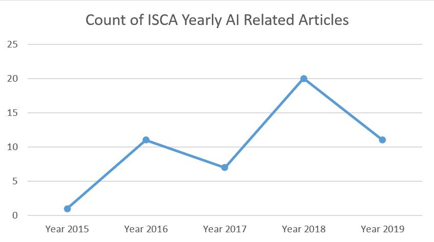
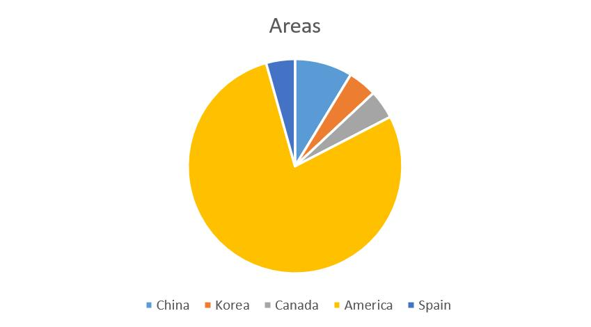
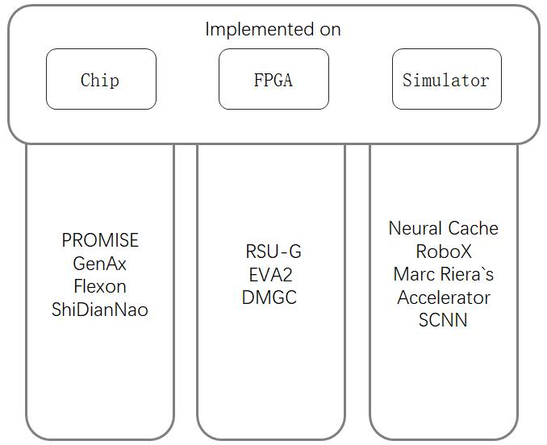
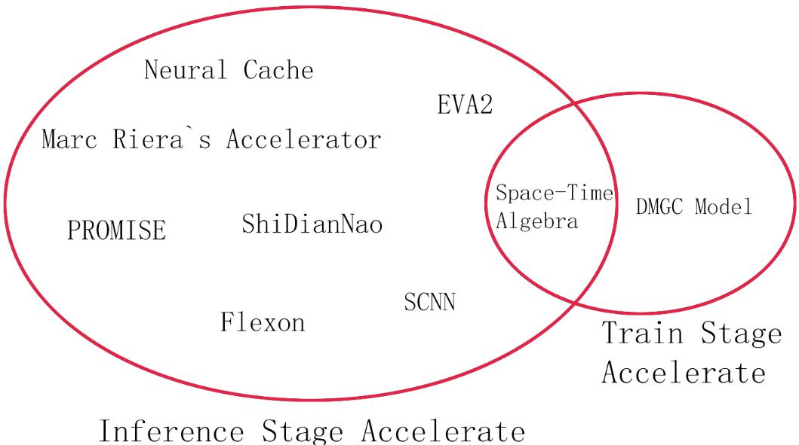

# Table of Contents

 - [About This Project](#about-this-project)
 - [Some Statistics of the Papers](#some-statistics-of-the-papers)
 - [The Chronological Listing of Papers](#the-chronological-listing-of-papers)

# About This Project

This project aims to collect and summarize the AI-related papers for readers who are interested in AI research in academia. We plan to collect all the AI-related papers in the top-tier architecture conferences such as ISCA, MICRO and HPCA in recent years. Now, we have collected them in ISCA from 2015 to 2019 with some basic analysis. These papers will be listed below and you can find our brief summaries in "/Summarys/#year_of_the_paper/". We are glad to have your suggestions of anything about this project!

# Some Statistics of the Papers
## 1.	The yearly paper count (now only based on ISCA 2015-2019 statistics)
  

 
The trend of AI is generaly increasing. But now it slightly slow down in 2019. And we can find out that year 2018 takes almost half of the counts, implicating the hottest year of AI accelerators.
 

## 2.	The countries and regions that contribute (now only based on ISCA 2015-2019 statistics)

 
America is definitely the origin area of most papers. China and North Korea are still two chasing character in AI research though they have done somg terrific ahievements.
 

## 3. The most appeared authors and their information (now only based on ISCA 2015-2019 statistics)

 
Here are the names appear most frequently on the collected papers. We collect thier public information and list below to help you find the leader researchers in this area. 
 

|  Author  |	 Counts of paper  | 	Region  | 	Lab or Corp.  |
| ----  |  ----  |  ----  | ----  |
| Hadi Esmaeilzadeh |	4	| US	| Alternative Computing Technologies (ACT) Laboratory, University of California |
| Mingcong Song	| 3 |	US	| Intelligent Design of Efficient Architectures Laboratory (IDEAL), University of Florida |
| Reetuparna Das |	3	| US	| EECS department, University of Michigan |
| Tao Li |	3 |	US |	Intelligent Design of Efficient Architectures Laboratory (IDEAL), University of Florida |
| Tianshi Chen |	3 | China	| Cambricon Technologies Corporation Limited(寒武纪科技) |
| Yunji Chen |	3 | China	| Institute of Computing Technology, Chinese Academy of Sciences |
| Zidong Du |	3 | China	| Institute of Computing Technology, Chinese Academy of Sciences |

 

<!--
# Tech Poins Summary
The figure below summarys how every architechture proposed was implemented to take the experiments.
 

 
And this figure below summarys the scene accelerators supposed to be used at.
 

 
 
-->

<!--
<table>
  <tr>
    <th text-align="center">Archs or Methods
    <th text-align="center">Paper(link with origin text)
    <th text-align="center">Our Summary
  </tr>
  <tr>
    <th text-align="center">Cambricon
    <th text-align="center">[Cambricon: An Instruction Set Architecture for Neural Networks](https://ieeexplore.ieee.org/document/7551409)
    <th text-align="center">[Our Summary](https://github.com/ghzgt/AI_paper_ISCA_test/blob/master/Summarys/2016/Cambricon%20An%20Instruction%20Set%20Architecture%20for%20Neural%20Networks.docx)
  </tr>
  <tr>
    <th text-align="center">RANA
    <th text-align="center">[RANA: Towards Efficient Neural Acceleration with Refresh-Optimized Embedded DRAM](https://ieeexplore.ieee.org/document/8416839)
    <th text-align="center">[Our Summary](https://github.com/ghzgt/AI_paper_ISCA_test/blob/master/Summarys/2018/RANA%20Towards%20Efficient%20Neural%20Acceleration%20with%20Refresh-Optimized%20Embedded%20DRAM%20.docx)
  </tr>
</table>
 
-->
<!--
|  Archs or Methods   | Paper(link with origin text)  | Summarys |
|  ----  | ----  | ----  |
| Cambricon  | [Cambricon: An Instruction Set Architecture for Neural Networks](https://ieeexplore.ieee.org/document/7551409) | [Available](https://github.com/ghzgt/AI_paper_ISCA_test/blob/master/Summarys/2016/Cambricon%20An%20Instruction%20Set%20Architecture%20for%20Neural%20Networks.docx) |
| RANA  | [RANA: Towards Efficient Neural Acceleration with Refresh-Optimized Embedded DRAM](https://ieeexplore.ieee.org/document/8416839) | [Available](https://github.com/ghzgt/AI_paper_ISCA_test/blob/master/Summarys/2018/RANA%20Towards%20Efficient%20Neural%20Acceleration%20with%20Refresh-Optimized%20Embedded%20DRAM%20.docx) |

-->

<!--
## The Archs or Methods Listing of Papers 
<table>
  <tr>
    <th text-align="center">Archs or Methods
    <th text-align="center">Paper Name(link with summary)
  </tr>
  <tr>
    <th text-align="center">Cambricon
    <th text-align="center">[Cambricon: An Instruction Set Architecture for Neural Networks](https://github.com/ghzgt/AI_paper_ISCA_test/blob/master/Summarys/2016/Cambricon%20An%20Instruction%20Set%20Architecture%20for%20Neural%20Networks.docx)
  </tr>
  <tr>
    <th text-align="center">RANA
    <th text-align="center">[RANA: Towards Efficient Neural Acceleration with Refresh-Optimized Embedded DRAM](https://github.com/ghzgt/AI_paper_ISCA_test/blob/master/Summarys/2018/RANA%20Towards%20Efficient%20Neural%20Acceleration%20with%20Refresh-Optimized%20Embedded%20DRAM%20.docx)
  </tr>
</table>
 
|  Archs or Methods   | Paper Name(linkable means summarized)  |
|  ----  | ----  |
| TSVA | [3D-based video recognition acceleration by leveraging temporal locality](about:blank) |
| Cloud-Scale DNN Processor | [A Configurable Cloud-Scale DNN Processor for Real-Time AI ](https://github.com/ghzgt/AI_paper_ISCA_test/blob/master/Summarys/2018/A%20Configurable%20Cloud-Scale%20DNN%20Processor%20for%20Real-Time%20AI.docx) |
| Architecture of Ruizhe Cai and Ao Ren | [A stochastic-computing based deep learning framework using adiabatic quantum-flux-parametron superconducting technology Share on](about:blank) |
| iSwitch | [Accelerating distributed reinforcement learning with in-switch computing](https://github.com/ghzgt/AI_paper_ISCA_test/blob/master/Summarys/2019/Accelerating%20Distributed%20Reinforcement%20Learning%20with%20In-Switch%20Computing.docx) |
| Markov Accelerator | [Accelerating Markov Random Field Inference Using Molecular Optical Gibbs Sampling Units ](https://github.com/ghzgt/AI_paper_ISCA_test/blob/master/Summarys/2016/Accelerating%20Markov%20Random%20Field%20Inference%20Using%20Molecular%20Optical%20Gibbs%20Sampling%20Units.docx) |
| A New RSU-G | [Architecting a Stochastic Computing Unit with Molecular Optical Devices ](about:blank) |
| Bit Fusion | [Bit Fusion: Bit-Level Dynamically Composable Architecture for Accelerating Deep Neural Network](about:blank) |
| Cambricon | [Cambricon: An Instruction Set Architecture for Neural Networks ](https://github.com/ghzgt/AI_paper_ISCA_test/blob/master/Summarys/2016/Cambricon%20An%20Instruction%20Set%20Architecture%20for%20Neural%20Networks.docx) |
| Cambricon-F | [Cambricon-F_ machine learning computers with fractal von neumann architecture](https://github.com/ghzgt/AI_paper_ISCA_test/blob/master/Summarys/2019/Cambricon-F%20Machine%20Learning%20Computers%20with%20Fractal%20von%20Neumann%20Architecture.docx) |
| Cnvlutin | [Cnvlutin: Ineffectual-Neuron-Free Deep Neural Network Computing ](https://github.com/ghzgt/AI_paper_ISCA_test/blob/master/Summarys/2016/Cnvlutin%20Ineffectual-Neuron-Free%20Deep%20Neural%20Network%20Computing%20.docx) |
| DNN Computation Reuse  | [Computation Reuse in DNNs by Exploiting Input Similarity ](about:blank) |
| Eager Pruning (system) | [Eager pruning_ algorithm and architecture support for fast training of deep neural networks](https://github.com/ghzgt/AI_paper_ISCA_test/blob/master/Summarys/2019/Eager%20Pruning%20Algorithm%20and%20Architecture%20Support%20for%20Fast%20Training%20of%20Deep%20Neural%20Networks.docx) |
| EIE | [EIE: Efficient Inference Engine on Compressed Deep Neural Network](about:blank) |
| Graph Analytics Accelerators  | [Energy Efficient Architecture for Graph Analytics Accelerators ](https://github.com/ghzgt/AI_paper_ISCA_test/blob/master/Summarys/2016/Energy%20Efficient%20Architecture%20for%20Graph%20Analytics%20Accelerators.docx) |
| Outlier-Aware Neural Network Accelerator | [Energy-Efficient Neural Network Accelerator Based on Outlier-Aware Low-Precision Computation](https://github.com/ghzgt/AI_paper_ISCA_test/blob/master/Summarys/2018/Energy-efficient%20Neural%20Network%20Accelerator%20Based%20on%20Outlier-aware%20Low-precision%20Computation.docx) |
| Euphrates | [Euphrates: Algorithm-SoC Co-Design for Low-Power Mobile Continuous Vision ](https://github.com/ghzgt/AI_paper_ISCA_test/blob/master/Summarys/2018/Euphrates%20Algorithm-SoC%20Co-Design%20for%20Low-Power%20Mobile%20Continuous%20Vision.docx) |
| EVA2 | [EVA2: Exploiting Temporal Redundancy in Live Computer Vision ](about:blank) |
| Eyeriss | [Eyeriss: A Spatial Architecture for Energy-Efficient Dataflow for Convolutional Neural Networks ](about:blank) |
| Flexon | [Flexon: A Flexible Digital Neuron for Efficient Spiking Neural Network Simulations ](about:blank) |
| FloatPIM (system) | [FloatPIM_ in-memory acceleration of deep neural network training with high precision](https://github.com/ghzgt/AI_paper_ISCA_test/blob/master/Summarys/2019/FloatPIM%20in-memory%20acceleration%20of%20deep%20neural%20network%20training%20with%20high%20precision.docx) |
| GANAX | [GANAX: A Unified MIMD-SIMD Acceleration for Generative Adversarial Networks](https://github.com/ghzgt/AI_paper_ISCA_test/blob/master/Summarys/2018/GANAX%20A%20Unified%20MIMD-SIMD%20Acceleration%20for%20Generative%20Adversarial%20Networks.docx) |
| GenAx | [GenAx: A Genome Sequencing Accelerator ](about:blank) |
| Gist | [Gist: Efficient Data Encoding for Deep Neural Network Training ](about:blank) |
| TPU | [In-Datacenter Performance Analysis of a Tensor Processing Unit](about:blank) |
| ISAAC | [ISAAC: A Convolutional Neural Network Accelerator with In-Situ Analog Arithmetic in Crossbars ](about:blank) |
| Laconic | [Laconic deep learning inference acceleration](https://github.com/ghzgt/AI_paper_ISCA_test/blob/master/Summarys/2019/Laconic%20Deep%20Learning%20Inference%20Acceleration.docx) |
| None( this paper only put out a comparision) | [Master of none acceleration_ a comparison of accelerator architectures for analytical query processing](https://github.com/ghzgt/AI_paper_ISCA_test/blob/master/Summarys/2019/Master%20of%20None%20Acceleration%20A%20Comparison%20of%20Accelerator%20Architectures%20for%20Analytical%20Query%20Processing.docx) |
| Multi-CLP (approach) | [Maximizing CNN Accelerator Efficiency Through Resource Partitioning](about:blank) |
| Minerva | [Minerva: Enabling Low-Power, Highly-Accurate Deep Neural Network Accelerators ](https://github.com/ghzgt/AI_paper_ISCA_test/blob/master/Summarys/2016/Minerva%20Enabling%20Low-Power%2C%20Highly-Accurate%20Deep%20Neural%20Network%20Accelerators%20.docx) |
| MnnFast | [MnnFast_ a fast and scalable system architecture for memory-augmented neural networks](https://github.com/ghzgt/AI_paper_ISCA_test/blob/master/Summarys/2019/MnnFast%20A%20Fast%20and%20Scalable%20System%20Architecture%20for%20Memory-Augmented%20Neural%20Network.docx) |
| Neural Cache | [Neural Cache: Bit-Serial In-Cache Acceleration of Deep Neural Networks ](about:blank) |
| Neurocube | [Neurocube: A Programmable Digital Neuromorphic Architecture with High-Density 3D Memory ](https://github.com/ghzgt/AI_paper_ISCA_test/blob/master/Summarys/2016/Neurocube%20A%20Programmable%20Digital%20Neuromorphic%20Architecture%20with%20High-Density%203D%20Memory.docx) |
| USPE | [Prediction Based Execution on Deep Neural Networks](about:blank) |
| PRIME | [PRIME: A Novel Processing-in-Memory Architecture for Neural Network Computation in ReRAM-Based Main Memory](about:blank) |
| PROMISE | [PROMISE: An End-to-End Design of a Programmable Mixed-Signal Accelerator for Machine- Learning Algorithms ](about:blank) |
| RANA | [RANA: Towards Efficient Neural Acceleration with Refresh-Optimized Embedded DRAM ](https://github.com/ghzgt/AI_paper_ISCA_test/blob/master/Summarys/2018/RANA%20Towards%20Efficient%20Neural%20Acceleration%20with%20Refresh-Optimized%20Embedded%20DRAM%20.docx) |
| RedEye | [RedEye: Analog ConvNet Image Sensor Architecture for Continuous Mobile ](about:blank) |
| RoboX | [RoboX: An End-to-End Solution to Accelerate Autonomous Control in Robotics ](about:blank) |
| ScaleDeep | [ScaleDeep_ A Scalable Compute Architecture for Learning and Evaluating Deep Networks](about:blank) |
| Scalpel | [Scalpel_ Customizing DNN Pruning to the Underlying Hardware Parallelism](about:blank) |
| SCNN | [SCNN_ An Accelerator for Compressed-sparse Convolutional Neural Networks](https://github.com/ghzgt/AI_paper_ISCA_test/blob/master/Summarys/2017/SCNN%20An%20Accelerator%20for%20Compressed-sparse%20Convolutional%20Neural%20Networks.docx) |
| ShiDianNao | [ShiDianNao_ shifting vision processing closer to the sensor](https://github.com/ghzgt/AI_paper_ISCA_test/blob/master/Summarys/2015/ShiDianNao%20Shifting%20Vision%20Processing%20Closer%20to%20the%20Sensor.docx) |
| SnaPEA | [SnaPEA: Predictive Early Activation for Reducing Computation in Deep Convolutional Neural Networks](https://github.com/ghzgt/AI_paper_ISCA_test/blob/master/Summarys/2018/SnaPEA%20Predictive%20Early%20Activation%20for%20Reducing%20Computation%20in%20Deep%20Convolutional%20Neural%20Networks.docx) |
| Space-Time Algebra | [Space-Time Algebra: A Model for Neocortical Computation ](about:blank) |
| Sparse ReRAM Engine (SRE) | [Sparse ReRAM engine_ joint exploration of activation and weight sparsity in compressed neural networks](https://github.com/ghzgt/AI_paper_ISCA_test/blob/master/Summarys/2019/Sparse%20ReRAM%20Engine%20Joint%20Exploration%20of%20Activation%20and%20Weight%20Sparsity%20in%20Compressed%20Neural%20Networks.docx) |
| Softbrain | [Stream-Dataflow Acceleration](about:blank) |
| DNN pruning with Viterbi search | [The Dark Side of DNN Pruning ](about:blank) |
| TIE | [TIE_ energy-efficient tensor train-based inference engine for deep neural network Share on](https://github.com/ghzgt/AI_paper_ISCA_test/blob/master/Summarys/2019/TIE%20Energy-efficient%20Tensor%20Train-based%20Inference%20Engine%20for%20Deep%20Neural%20Network.docx) |
| UCNN | [UCNN: Exploiting Computational Reuse in Deep Neural Networks via Weight Repetition ](https://github.com/ghzgt/AI_paper_ISCA_test/blob/master/Summarys/2018/UCNN%20Exploiting%20Computational%20Reuse%20in%20Deep%20Neural%20Networks%20via%20Weight%20Repetition.docx) |
| DMGC (model) | [Understanding and Optimizing Asynchronous Low-Precision Stochastic Gradient Descent](about:blank) |
  
-->

# The Chronological Listing of Papers

 
Now we list all the papers we have collected. If it is linkable, it link to the summary of the paper and the summaries are still updating. 

## ISCA 2015
<table>
  <tr>
    <th text-align="center">
    <th text-align="center">Title
    <th text-align="center">Authors
    <th text-align="center">Area
    <th text-align="center">Organization
  </tr>
  <tr>
    <th text-align="center">1
    <!--
    <th text-align="left">ShiDianNao: Shifting Vision Processing Closer to the Sensor
    -->
    <td><a href="Summarys/2015/ShiDianNao Shifting Vision Processing Closer to the Sensor.docx">ShiDianNao: Shifting Vision Processing Closer to the Sensor</a></td>
    <th text-align="left">Zidong Du
    <th text-align="center">China
    <th text-align="left">ICT
  </tr>
</table>
 

## ISCA 2016
<table>
  <tr>
    <th text-align="center">
    <th text-align="center">Title
    <th text-align="center">Authors
    <th text-align="center">Area
    <th text-align="center">Organization
  </tr>
  <tr>
    <th text-align="center">1
    <!--
    <th text-align="left">Cnvlutin: Ineffectual-Neuron-Free Deep Neural Network Computing 
    -->
    <td><a href="Summarys/2016/Cnvlutin Ineffectual-Neuron-Free Deep Neural Network Computing .docx">Cnvlutin: Ineffectual-Neuron-Free Deep Neural Network Computing</a></td>
    <th text-align="left">Jorge Albericio, Tayler Hetheringto
    <th text-align="center">Canada
    <th text-align="left">University of Toronto, University of British Columbia
  </tr>
  <tr>
    <th text-align="center">2
    <th text-align="left">ISAAC: A Convolutional Neural Network Accelerator with In-Situ Analog Arithmetic in Crossbars 
    <th text-align="left">Ali Shafiee, Vivek Srikumar
    <th text-align="center">US
    <th text-align="left">University of Utah，Hewlett Packard Labs
  </tr>
  <tr>
    <th text-align="center">3
    <th text-align="left">PRIME: A Novel Processing-in-Memory Architecture for Neural Network Computation in ReRAM-Based Main Memory
    <th text-align="left">Ping Chi, Yuan Xie
    <th text-align="center">US
    <th text-align="left">University of California 
  </tr>
  <tr>
    <th text-align="center">4
    <th text-align="left">EIE: Efficient Inference Engine on Compressed Deep Neural Network
    <th text-align="left">Song Han, William J. Dally
    <th text-align="center">US
    <th text-align="left">Stanford University, NVIDIA
  </tr>
  <tr>
    <th text-align="center">5
    <th text-align="left">RedEye: Analog ConvNet Image Sensor Architecture for Continuous Mobile 
    <th text-align="left">Robert LiKamWa, Lin Zhong
    <th text-align="center">US
    <th text-align="left">Rice University
  </tr>
  <tr>
    <th text-align="center">6
    <!--
    <th text-align="left">Minerva: Enabling Low-Power, Highly-Accurate Deep Neural Network Accelerators 
    -->
    <td><a href="Summarys/2016/Minerva Enabling Low-Power, Highly-Accurate Deep Neural Network Accelerators .docx">Minerva: Enabling Low-Power, Highly-Accurate Deep Neural Network Accelerators</a></td>
    <th text-align="left">Brandon Reagen, David Brooks
    <th text-align="center">US
    <th text-align="left">Harvard University 
  </tr>
  <tr>
    <th text-align="center">7
    <th text-align="left">Eyeriss: A Spatial Architecture for Energy-Efficient Dataflow for Convolutional Neural Networks 
    <th text-align="left">Yu-Hsin Chen, Vivienne Sze
    <th text-align="center">US
    <th text-align="left">MIT, NVIDIA
  </tr>
  <tr>
    <th text-align="center">8
    <!--
    <th text-align="left">Neurocube: A Programmable Digital Neuromorphic Architecture with High-Density 3D Memory 
    -->
    <td><a href="Summarys/2016/Neurocube A Programmable Digital Neuromorphic Architecture with High-Density 3D Memory.docx">Neurocube: A Programmable Digital Neuromorphic Architecture with High-Density 3D Memory</a></td>
    <th text-align="left">Duckhwan Kim, Saibal Mukhopadhyay
    <th text-align="center">US
    <th text-align="left">Georgia Institute of Technology 
  </tr>
  <tr>
    <th text-align="center">9
    <!--
    <th text-align="left">Cambricon: An Instruction Set Architecture for Neural Networks 
    -->
    <td><a href="Summarys/2016/Cambricon An Instruction Set Architecture for Neural Networks.docx">Cambricon: An Instruction Set Architecture for Neural Networks</a></td>
    <th text-align="left">Shaoli Liu, Tianshi Chen
    <th text-align="center">China
    <th text-align="left">CAS, Cambricon Ltd.
  </tr>
  <tr>
    <th text-align="center">10
    <!--
    <th text-align="left">Energy Efficient Architecture for Graph Analytics Accelerators 
    -->
    <td><a href="Summarys/2016/Energy Efficient Architecture for Graph Analytics Accelerators.docx">Energy Efficient Architecture for Graph Analytics Accelerators</a></td>
    <th text-align="left">Muhammet Mustafa Ozdal, Ozcan Ozturk
    <th text-align="center">Turkey
    <th text-align="left">Bilkent University
  </tr>
  <tr>
    <th text-align="center">11
    <!--
    <th text-align="left">Accelerating Markov Random Field Inference Using Molecular Optical Gibbs Sampling Units 
    -->
    <td><a href="Summarys/2016/Accelerating Markov Random Field Inference Using Molecular Optical Gibbs Sampling Units.docx">Accelerating Markov Random Field Inference Using Molecular Optical Gibbs Sampling Units</a></td>
    <th text-align="left">Siyang Wang, Alvin R. Lieberk
    <th text-align="center">US
    <th text-align="left">Duke University
  </tr>
</table>
 

## ISCA 2017
<table>
  <tr>
    <th text-align="center">
    <th text-align="center">Title
    <th text-align="center">Authors
    <th text-align="center">Area
    <th text-align="center">Organization
  </tr>
  <tr>
    <th text-align="center">1
    <th text-align="left">In-Datacenter Performance Analysis of a Tensor Processing Unit
    <th text-align="left">Norman P. Jouppi
    <th text-align="center">US
    <th text-align="left">Google
  </tr>
  <tr>
    <th text-align="center">2
    <th text-align="left">Maximizing CNN Accelerator Efficiency Through Resource Partitioning
    <th text-align="left">Yongming Shen
    <th text-align="center">US
    <th text-align="left">Stony Brook University
  </tr>
  <tr>
    <th text-align="center">3
    <th text-align="left">SCALEDEEP: A Scalable Compute Architecture for Learning and Evaluating Deep Networks
    <th text-align="left">Swagath Venkataramani, Anand Raghunathan
    <th text-align="center">US
    <th text-align="left">Purdue University, Parallel Computing Lab, Intel Corporation
  </tr>
  <tr>
    <th text-align="center">4
    <th text-align="left">Scalpel: Customizing DNN Pruning to the Underlying Hardware Parallelism
    <th text-align="left">Jiecao Yu, Scott Mahlke
    <th text-align="center">US
    <th text-align="left">University of Michigan, ARM
  </tr>
  <tr>
    <th text-align="center">5
    <!--
    <th text-align="left">SCNN: An Accelerator for Compressed-sparse Convolutional Neural Networks
    -->
    <td><a href="Summarys/2017/SCNN An Accelerator for Compressed-sparse Convolutional Neural Networks.docx">SCNN: An Accelerator for Compressed-sparse Convolutional Neural Networks</a></td>
    <th text-align="left">Angshuman Parashar, William J. Dally
    <th text-align="center">US
    <th text-align="left">NVIDIA, MIT, UC-Berkeley, Stanford University
  </tr>
  <tr>
    <th text-align="center">6
    <th text-align="left">Stream-Dataflow Acceleration
    <th text-align="left">Tony Nowatzki
    <th text-align="center">US
    <th text-align="left">University of California, University of Wisconsin
  </tr>
  <tr>
    <th text-align="center">7
    <th text-align="left">Understanding and Optimizing Asynchronous Low-Precision Stochastic Gradient Descent
    <th text-align="left">Christopher De Sa, Kunle Olukotun
    <th text-align="center">US
    <th text-align="left">Stanford University
  </tr>
</table>
 

## ISCA 2018
<table>
  <tr>
    <th text-align="center">
    <th text-align="center">Title
    <th text-align="center">Authors
    <th text-align="center">Area
    <th text-align="center">Organization
  </tr>
  <tr>
    <th text-align="center">1
    <!--
    <th text-align="left">A Configurable Cloud-Scale DNN Processor for Real-Time AI 
    -->
    <td><a href="Summarys/2018/A Configurable Cloud-Scale DNN Processor for Real-Time AI.docx">A Configurable Cloud-Scale DNN Processor for Real-Time AI</a></td>
    <th text-align="left">Jeremy Fowers, Doug Burger
    <th text-align="center">US
    <th text-align="left">Microsoft 
  </tr>
  <tr>
    <th text-align="center">2
    <th text-align="left">PROMISE: An End-to-End Design of a Programmable Mixed-Signal Accelerator for Machine- Learning Algorithms 
    <th text-align="left">Prakalp Srivastava, Mingu Kang
    <th text-align="center">US
    <th text-align="left">University of Illinois at Urbana-Champaign, IBM
  </tr>
  <tr>
    <th text-align="center">3
    <th text-align="left">Computation Reuse in DNNs by Exploiting Input Similarity 
    <th text-align="left">Marc Riera, Antonio Gonza ?lez
    <th text-align="center">Spain
    <th text-align="left">Universitat Polite ?cnica de Catalunya 
  </tr>
  <tr>
    <th text-align="center">4
    <!-- 
    <th text-align="left">GenAx: A Genome Sequencing Accelerator 
    -->
    <td><a href="Summarys/2018/GANAX A Unified MIMD-SIMD Acceleration for Generative Adversarial Networks.docx">GenAx: A Genome Sequencing Accelerator</a></td>
    <th text-align="left">Daichi Fujiki, Satish Narayanasamy
    <th text-align="center">US
    <th text-align="left">University of Michigan 
  </tr>
  <tr>
    <th text-align="center">5
    <th text-align="left">Flexon: A Flexible Digital Neuron for Efficient Spiking Neural Network Simulations 
    <th text-align="left">Dayeol Lee, Jangwoo Kim
    <th text-align="center">North Korea,US
    <th text-align="left">Seoul National University, University of California
  </tr>
  <tr>
    <th text-align="center">6
    <th text-align="left">Space-Time Algebra: A Model for Neocortical Computation 
    <th text-align="left">James E. Smith 
    <th text-align="center">US
    <th text-align="left">University of Wisconsin-Madison 
  </tr>
  <tr>
    <th text-align="center">7
    <th text-align="left">Architecting a Stochastic Computing Unit with Molecular Optical Devices 
    <th text-align="left">Xiangyu Zhang, Alvin R. Lebeck 
    <th text-align="center">US
    <th text-align="left">Duke University, Parabon Labs
  </tr>
  <tr>
    <th text-align="center">8
    <!--
    <th text-align="left">RANA: Towards Efficient Neural Acceleration with Refresh-Optimized Embedded DRAM 
    -->
    <td><a href="Summarys/2018/RANA Towards Efficient Neural Acceleration with Refresh-Optimized Embedded DRAM .docx">RANA: Towards Efficient Neural Acceleration with Refresh-Optimized Embedded DRAM</a></td>
    <th text-align="left">Fengbin Tu, Shaojun Wei
    <th text-align="center">China
    <th text-align="left">Tsinghua University
  </tr>
  <tr>
    <th text-align="center">9
    <th text-align="left">Neural Cache: Bit-Serial In-Cache Acceleration of Deep Neural Networks 
    <th text-align="left">Charles Eckert, Reetuparna Das
    <th text-align="center">US
    <th text-align="left">University of Michigan, Intel Corporation
  </tr>
  <tr>
    <th text-align="center">10
    <th text-align="left">RoboX: An End-to-End Solution to Accelerate Autonomous Control in Robotics 
    <th text-align="left">Jacob Sacks, Hadi Esmaeilzadeh
    <th text-align="center">US
    <th text-align="left">Georgia Institute of Technology, University of California, San Diego
  </tr>
  <tr>
    <th text-align="center">11
    <th text-align="left">EVA2: Exploiting Temporal Redundancy in Live Computer Vision 
    <th text-align="left">Mark Buckler, Adrian Sampson
    <th text-align="center">US
    <th text-align="left">Cornell University 
  </tr>
  <tr>
    <th text-align="center">12
    <!--
    <th text-align="left">Euphrates: Algorithm-SoC Co-Design for Low-Power Mobile Continuous Vision 
    -->
    <td><a href="Summarys/2018/Euphrates Algorithm-SoC Co-Design for Low-Power Mobile Continuous Vision.docx">Euphrates: Algorithm-SoC Co-Design for Low-Power Mobile Continuous Vision</a></td>
    <th text-align="left">Yuhao Zhu, Paul Whatmough
    <th text-align="center">US
    <th text-align="left">University of Rochetster, ARM Research
  </tr>
  <tr>
    <th text-align="center">13
    <!--
    <th text-align="left">GANAX: A Unified MIMD-SIMD Acceleration for Generative Adversarial Networks
    -->
    <td><a href="Summarys/2018/GANAX A Unified MIMD-SIMD Acceleration for Generative Adversarial Networks.docx">GANAX: A Unified MIMD-SIMD Acceleration for Generative Adversarial Networks</a></td>
    <th text-align="left">Amir Yazdanbakhsh, Hadi Esmaeilzadeh
    <th text-align="center">US
    <th text-align="left">Georgia Institute of Technology, UC San Diego, Qualcomm Technologies, Inc.
  </tr>
  <tr>
    <th text-align="center">14
    <!-- 
    <th text-align="left">SnaPEA: Predictive Early Activation for Reducing Computation in Deep Convolutional Neural Networks
    -->
    <td><a href="Summarys/2018/SnaPEA Predictive Early Activation for Reducing Computation in Deep Convolutional Neural Networks.docx">SnaPEA: Predictive Early Activation for Reducing Computation in Deep Convolutional Neural Networks</a></td>
    <th text-align="left">Vahideh Akhlaghi, Hadi Esmaeilzadeh
    <th text-align="center">US
    <th text-align="left">Georgia Institute of Technology, UC San Diego, Qualcomm Technologies, Inc.
  </tr>
  <tr>
    <th text-align="center">15
    <!-- 
    <th text-align="left">UCNN: Exploiting Computational Reuse in Deep Neural Networks via Weight Repetition 
    -->
    <td><a href="Summarys/2018/UCNN Exploiting Computational Reuse in Deep Neural Networks via Weight Repetition.docx">UCNN: Exploiting Computational Reuse in Deep Neural Networks via Weight Repetition</a></td>
    <th text-align="left">Kartik Hegde, Christopher W. Fletche
    <th text-align="center">US
    <th text-align="left">University of Illinois at Urbana-Champaign,  NVIDIA
  </tr>
  <tr>
    <th text-align="center">16
    <!--
    <th text-align="left">Energy-Efficient Neural Network Accelerator Based on Outlier-Aware Low-Precision Computation
    -->
    <td><a href="Summarys/2018/Energy-efficient Neural Network Accelerator Based on Outlier-aware Low-precision Computation.docx">Energy-Efficient Neural Network Accelerator Based on Outlier-Aware Low-Precision Computation</a></td>
    <th text-align="left">Eunhyeok Park, Sungjoo Yoo 
    <th text-align="center">North Korea
    <th text-align="left">Seoul National University 
  </tr>
  <tr>
    <th text-align="center">17
    <th text-align="left">Prediction Based Execution on Deep Neural Networks
    <th text-align="left">Mingcong Song, Tao Li
    <th text-align="center">US
    <th text-align="left">University of Flirida
  </tr>
  <tr>
    <th text-align="center">18
    <th text-align="left">Bit Fusion: Bit-Level Dynamically Composable Architecture for Accelerating Deep Neural Network
    <th text-align="left">Hardik Sharma, Hadi Esmaeilzadeh
    <th text-align="center">US
    <th text-align="left">Georgia Institute of Technology, University of California
  </tr>
  <tr>
    <th text-align="center">19
    <th text-align="left">Gist: Efficient Data Encoding for Deep Neural Network Training 
    <th text-align="left">Animesh Jain, Gennady Pekhimenko
    <th text-align="center">US,Canada
    <th text-align="left">Microsoft Research, University of Toronto, Univerity of Michigan
  </tr>
  <tr>
    <th text-align="center">20
    <th text-align="left">The Dark Side of DNN Pruning 
    <th text-align="left">Reza Yazdani, Antonio Gonza ?lez
    <th text-align="center">Spain
    <th text-align="left">Universitat Polite ?cnica de Catalunya 
  </tr>
</table>
 

## ISCA 2019
<table>
  <tr>
    <th text-align="center">
    <th text-align="center">Title
    <th text-align="center">Authors
    <th text-align="center">Area
    <th text-align="center">Organization
  </tr>
  <tr>
    <th text-align="center">1
    <th text-align="left">3D-based Video Recognition Acceleration by Leveraging Temporal Locality
    <th text-align="left">Huixiang Chen, Tao Li
    <th text-align="center">US
    <th text-align="left">University of Florida
  </tr>
  <tr>
    <th text-align="center">2
    <th text-align="left">A Stochastic-Computing based Deep Learning Framework using Adiabatic Quantum-Flux-Parametron Superconducting Technology
    <th text-align="left">Ruizhe Cai, Ao Ren, Nobuyuki Yoshikawa, Yanzhi Wang
    <th text-align="center">US
    <th text-align="left">Northeastern University
  </tr>
  <tr>
    <th text-align="center">3
    <!--
    <th text-align="left">Accelerating Distributed Reinforcement Learning with In-Switch Computing
    -->
    <td><a href="Summarys/2019/Accelerating Distributed Reinforcement Learning with In-Switch Computing.docx">Accelerating Distributed Reinforcement Learning with In-Switch Computing</a></td>
    <th text-align="left">Youjie Li, Jian Huang
    <th text-align="center">US
    <th text-align="left">UIUC
  </tr>
  <tr>
    <th text-align="center">4
    <!--
    <th text-align="left">Eager Pruning: Algorithm and Architecture Support for Fast Training of Deep Neural Networks
    -->
    <td><a href="Summarys/2019/Eager Pruning Algorithm and Architecture Support for Fast Training of Deep Neural Networks.docx">Eager Pruning: Algorithm and Architecture Support for Fast Training of Deep Neural Networks</a></td>
    <th text-align="left">Jiaqi Zhang, Tao Li
    <th text-align="center">US
    <th text-align="left">University of Florida
  </tr>
  <tr>
    <th text-align="center">5
    <!--
    <th text-align="left">Laconic Deep Learning Inference Acceleration
    -->
    <td><a href="Summarys/2019/Laconic Deep Learning Inference Acceleration.docx">Laconic Deep Learning Inference Acceleration</a></td>
    <th text-align="left">Sayeh Sharify, Andreas Moshovos
    <th text-align="center">Canada
    <th text-align="left">University of Toronto
  </tr>
  <tr>
    <th text-align="center">6
    <!--
    <th text-align="left">MnnFast: A Fast and Scalable System Architecture for Memory-Augmented Neural Networks
    -->
    <td><a href="Summarys/2019/MnnFast A Fast and Scalable System Architecture for Memory-Augmented Neural Network.docx">MnnFast: A Fast and Scalable System Architecture for Memory-Augmented Neural Networks</a></td>
    <th text-align="left">Hanhwi Jang, Jangwoo Kim
    <th text-align="center">North Korea
    <th text-align="left">POSTECH, Seoul National University
  </tr>
  <tr>
    <th text-align="center">7
    <!--
    <th text-align="left">Sparse ReRAM Engine: Joint Exploration of Activation and Weight Sparsity in Compressed Neural Networks
    -->
    <td><a href="Summarys/2019/Sparse ReRAM Engine Joint Exploration of Activation and Weight Sparsity in Compressed Neural Networks.docx">Sparse ReRAM Engine: Joint Exploration of Activation and Weight Sparsity in Compressed Neural Networks</a></td>
    <th text-align="left">Tzu-Hsien Yang
    <th text-align="center">China Twain
    <th text-align="left">National Taiwan University, Academia Sinica, Macronix International Co., Ltd.
  </tr>
  <tr>
    <th text-align="center">8
    <!--
    <th text-align="left">TIE: Energy-efficient Tensor Train-based Inference Engine for Deep Neural Network
    -->
    <td><a href="Summarys/2019/TIE Energy-efficient Tensor Train-based Inference Engine for Deep Neural Network.docx">TIE: Energy-efficient Tensor Train-based Inference Engine for Deep Neural Network</a></td>
    <th text-align="left">Chunhua Deng, Bo Yuan
    <th text-align="center">US
    <th text-align="left">Rutgers University
  </tr>
  <tr>
    <th text-align="center">9
    <!--
    <th text-align="left">FloatPIM_ in-memory acceleration of deep neural network training with high precision
    -->
    <td><a href="Summarys/2019/FloatPIM in-memory acceleration of deep neural network training with high precision.docx">FloatPIM_ in-memory acceleration of deep neural network training with high precision</a></td>
    <th text-align="left">Mohsen Imani, Tajana Rosing
    <th text-align="center">US
    <th text-align="left">UC San Diego
  </tr>
  <tr>
    <th text-align="center">10
    <!--
    <th text-align="left">Cambricon-F_ machine learning computers with fractal von neumann architecture
    -->
    <td><a href="Summarys/2019/Cambricon-F Machine Learning Computers with Fractal von Neumann Architecture.docx">Cambricon-F_ machine learning computers with fractal von neumann architecture</a></td>
    <th text-align="left">Yongwei Zhao, Yunji Chen
    <th text-align="center">China
    <th text-align="left">ICT, Cambricon
  </tr>
  <tr>
    <th text-align="center">11
    <!--
    <th text-align="left">Master of none acceleration_ a comparison of accelerator architectures for analytical query processing
    -->
    <td><a href="Summarys/2019/Master of None Acceleration A Comparison of Accelerator Architectures for Analytical Query Processing.docx">Master of none acceleration_ a comparison of accelerator architectures for analytical query processing</a></td>
    <th text-align="left">Andrea Lottarini, Martha A. Kim
    <th text-align="center">US
    <th text-align="left">Google, Columbia University
  </tr>
</table>
