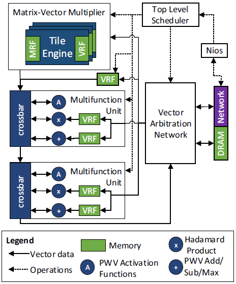

A Configurable Cloud-Scale DNN Processor for Real-Time AI

Corresponding author

Jeremy Fowers, Kalin Ovtcharov, Michael Papamichael, Todd Massengill, Ming Liu,
Daniel Lo, Shlomi Alkalay, Michael Haselman, Logan Adams, Mahdi Ghandi, Stephen
Heil, Prerak Patel, Adam Sapek, Gabriel Weisz, Lisa Woods, Sitaram Lanka, Steven
K. Reinhardt, Adrian M. Caulfield, Eric S. Chung, Doug Burger

Microsoft

Keywords

neural network hardware; accelerator architectures; field programmable gate
arrays

Neural Network Inference

Summary

*Challenge*

Highly parallel architectures with deep pipelines, such as GPGPUs, achieve high
throughput on DNN models by **batching evaluations**, exploiting parallelism
both within and across requests. This approach works well for offline training
where the training data set can be partitioned into “minibatches”. However,
systems optimized for batch through put typically can apply only a fraction of
their resources to a single request. In an **online inference setting**,
requests often arrive one at a time; a throughput architecture must either
process these requests individually, leading to reduced throughput while still
sustaining **batch-equivalent latency**, or incur **increased latency by
waiting** for multiple request arrivals to form a batch.

This paper focuses on online inference, which means only one request at a time
and no mini-batching, and proposed a full- system architecture.

*Contribution*

The authors proposed a FPGA-based or hardened (ASIC) full system architecture
targeted at low-latency high-throughput DNN accelerating with no mini batch
(so-called real-time AI).

The BW NPU implements a **single-threaded SIMD ISA** comprised of matrix-vector
and vector-vector operations, contrasting with most current accelerators which
are heavily multithreaded (e.g., GPUs) or fine-grained MIMD (e.g., Graphcore
[3]). The BW NPU is able to extract sufficient SIMD and pipeline parallelism to
provide high utilization from individual requests using single-threaded SIMD.
The single-threaded model also reduces the burden on software; rather than
relying on compilers or programmers to extract parallelism, the software that
runs on the BW NPU is primarily a linearization of the operators in the
accelerated subgraph.

On memory system, to minimize latency, the BW system typically pins DNN model
weights in distributed on-chip SRAM memories, which provide terabytes per second
of bandwidth at low power.

The BW NPU microarchitecture uses three techniques to extract parallelism:

1.  Hierarchical decode and dispatch (HDD), where compound SIMD operations are
    successively expanded into larger numbers of primitive operations and fanned
    out to the functional units. As an example, a single compound matrix-vector
    instruction will end up producing over 10,000 primitive operations.

2.  Vector-level parallelism (VLP), where the compound operations are broken
    into operations with a fixed native vector size (e.g. 100-400 operations per
    vector); it is these vector operations that form the primitives that are
    fanned out to the compute units (similar to scalar instructions in an ILP
    machine).

3.  The BW toolchain maps parallelized vector operations to a flat,
    one-dimensional network of vector functional units, and connects them in a
    dataflow manner so vectors can flow directly from one functional unit to
    another to minimize pipeline bubbles. Higher-level operations such as
    matrix-vector multiplications or convolutions are superimposed onto the flat
    vector unit space.

In the BW NPU, **all instructions operate on N-length 1D vectors or N×N 2D
matrices**. Vectors and matrices are treated as separate data types and stored
in independent register files. N is a fixed value in a given BW NPU
implementation. The **ideal vector size depends on the target set of models**—a
too-large vector requires inefficient padding, whereas a too-small vector
increases control overhead.

*Result*

Despite the lower clock rate and higher area overheads that FPGAs incur, the BW
NPU achieves record-setting performance for real-time AI, sustaining 35
Teraflops on large RNN benchmarks with no batching.

*Across a range of medium to large RNN benchmarks, running on a Stratix 10 FPGA,
the BW NPU achieves throughputs ranging from 11 to 35.9 Teraflops, at latencies
under 4 ms. These results use a low-precision floating-point format that
provides equivalent model scoring accuracy.*

*Comments*

The microarchitecture is meaningful for us, since **the basic unit of
instruction is vectors and matrices**. The design is somehow similar to Huawei’s
NPU, using a one-threaded SIMD and a big matrix-vector multiplier as key
computation composition. However, as a full-system architecture, the paper also
proposed a hyperscale datacenter network, in which many proposed FPGA/ASIC
accelerators work together, and the toolflow can partition large graphs that
exceed the capacity of a single FPGA into sub-graphs whose parameters can be
pinned individually into accelerators’ on-chip memory.
