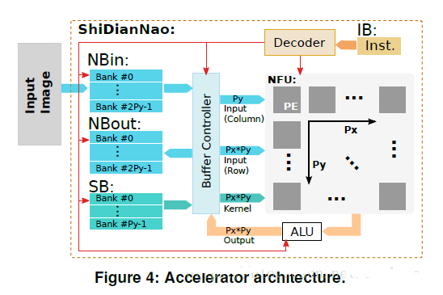

Summary of “ShiDianNao…”

To discuss ShiDianNao, it is important to lookback DianNao first.

Why did the Cambrian design ShiDianNao after DianNao already existed? Let's
first analyze the current defects of DianNao.

As we all know, deep learning algorithms are computationally and memory
intensive. This results in not low power consumption. When such chips are
applied to terminal embedded devices, such as smart phones, there are stringent
requirements for chip power consumption. Because the data in DianNao will be
stored in DRAM, and read and write of DRAM will consume very large power
consumption.

If you can avoid using DRAM to store data, you can greatly reduce power
consumption. It was based on this idea that ShiDianNao was born.

The idea of ​​ShiDianNao is that in actual application, the artificial
intelligence processor used for image recognition is relatively close to the
image source (CMOS / CCD sensor) in physical location, so that the image data
needs to be stored in DRAM. In addition, for the CNN algorithm, a commonly used
type of CNN shares weights, so that the number of weights is not large and can
be completely stored in the on-chip SRAM, so that the weights can be avoided
from being stored in the DRAM. After processing in this way, the entire system
does not need DRAM for storage, thereby greatly reducing power consumption.

In the above figure, the module is placed close to the sensor, and image data is
directly obtained from the sensor, which avoids the use of DRAM.

Let\`s see the architecture of ShiDianNao next.

The whole architecture is in the same vein as DianNao. The three buffers store
weights / input data / output data respectively. The core logic is the NFU on
the right, which is the PE array.

As can be seen from the above figure, the weight is broadcast to all PEs at the
same time, and the output is also passed to output at the same time. The input
data is matched with the two FIFOs inside each PE, and has different input
rules. Sometimes all PEs are provided with input at one time. Sometimes, only
one column is provided with the input and the remaining column is provided by
the adjacent right FIFO, and sometimes another column is provided with the input
and the remaining column is provided by the adjacent FIFO.

In summary, this paper proposed an accelerator for CV applications, and it only
accelerate the inference stage. Its architecture is implemented on the chip.
