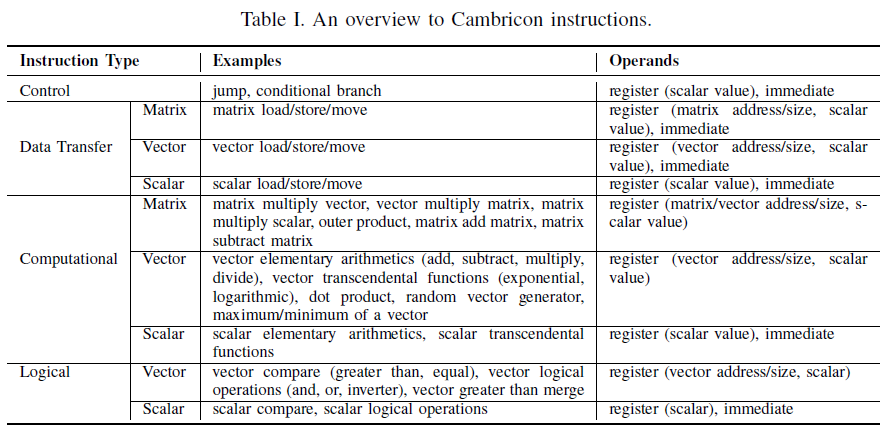

Cambricon: An Instruction Set Architecture for Neural Networks

Corresponding author

Shaoli Liu∗§, Zidong Du∗§, Jinhua Tao∗§, Dong Han∗§, Tao Luo∗§, Yuan Xie†, Yunji
Chen∗‡ and Tianshi Chen∗‡§

\*State Key Laboratory of Computer Architecture, ICT, CAS, Beijing, China

†Department of Electrical and Computer Engineering, UCSB, Santa Barbara, CA, USA

‡CAS Center for Excellence in Brain Science and Intelligence Technology

§Cambricon Ltd.

Keywords

Neuron Network, ISA

Summary

*Challenge*

Traditionally, NN techniques are executed on **general purpose platforms**
composed of CPUs and GPGPUs, which are usually **not energy-efficient** because
both types of processors invest excessive hardware resources to flexibly support
various workloads.

**Hardware accelerators** customized to NNs have been recently investigated as
energy-efficient alternatives. These accelerators often adopt high-level and
informative instructions (control signals) that directly specify the high-level
functional blocks or even an NN as a whole. However the **design/verification
complexity** and the **area/power overhead** of the **instruction decoder** for
such accelerators will easily become unacceptably large, when the need of
flexibly supporting a variety of different NN techniques results in a
**significant expansion of instruction set**.

As a result, the ISA design is still a fundamental yet unresolved challenge that
greatly limits both flexibility and efficiency of existing NN accelerators.

*Contribution*

The author proposed Cambricon, an lightweight ISA for NN accelerators inspired
by the success of RISC ISA design Principles. In details,

1.  Cambricon is **a load-store architecture** whose instructions are all
    64-bit, and contains 64 32-bit General-Purpose Registers (GPRs) for scalars,
    mainly for control and addressing purposes.

2.  Does not use any vector register file, but keeps data in on-chip scratchpad
    memory, which is visible to programmers/compilers.

3.  No need to implement multiple ports in the on-chip memory (as in the
    register file), as simultaneous accesses to different banks decomposed with
    addresses’ low-order bits are sufficient to supporting NN techniques.

4.  Unlike an SIMD whose performance is restricted by the limited width of
    register file, Cambricon efficiently supports larger and variable data width
    because the banks of on-chip scratchpad memory can easily be made wider than
    the register file.

The authors also conduct a comprehensive study on the computational patterns of
existing NN techniques, and evaluate the effectiveness of Cambricon with an
implementation of the first Cambricon based accelerator using TSMC 65nm
technology.

*Result*

The authors evaluated Cambricon over a total of ten representative yet distinct
NN techniques (MLP, CNN, RNN, LSTM, Autoencoder, Sparse Autoencoder, BM, RBM,
SOM, HNN), and observe that Cambricon provides **higher code density** than
general-purpose ISAs such as MIPS (13.38 times), x86 (9.86 times), and GPGPU
(6.41 times). Compared to the latest state-of-the-art NN accelerator design
DaDianNao (which can only accommodate 3 types of NN techniques), our
Cambricon-based accelerator prototype implemented in TSMC 65nm technology
**incurs only negligible latency, power, and area overheads** (4.5%/4.4%/1.6%,
respectively), with a versatile coverage of 10 different NN benchmarks.

*Comments*

Cambricon is a well-known NN accelerator, and this paper introduced the ISA it
used. The design of the ISA is focus on data-parallelism, and use on-chip
scratchpad memory instead of cache. The ISA seems based on SISD architecture
supporting extended data type (vectors and matrices), at least no
synchronization instruction in the ISA. The design of the ISA and the
corresponding accelerator may be a good example for future design of NN
accelerator processor (or independent processors in an array).
