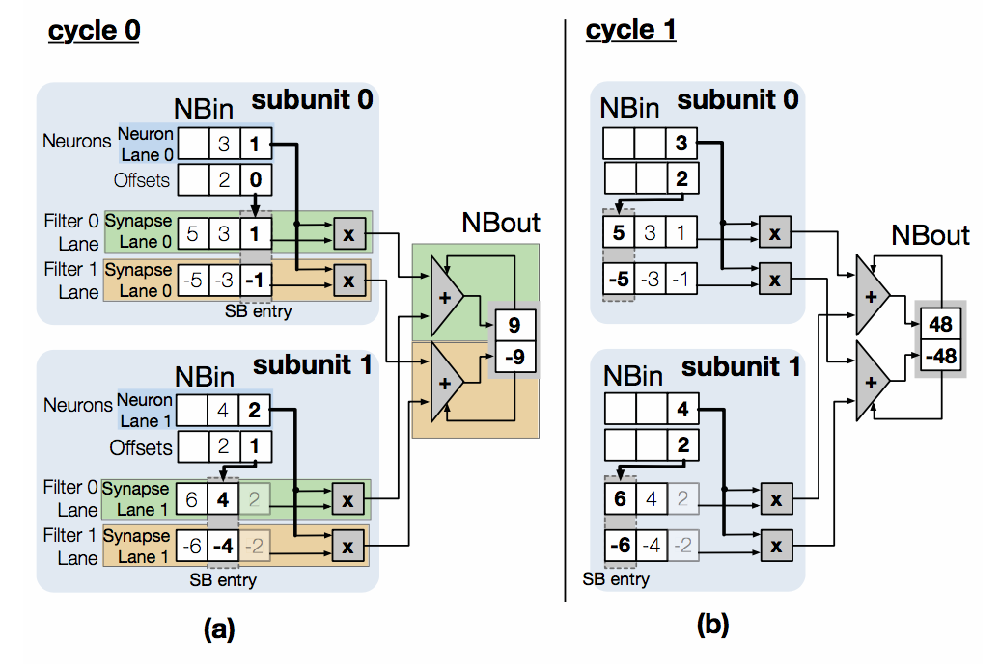

Cnvlutin: Ineffectual-Neuron-Free Deep Neural Network Computing 
----------------------------------------------------------------

### Corresponding author

Jorge Albericio, University of Toronto

Andreas Moshovos, University of Toronto

### Keywords

Neural Network; Accelerator; Dynamic sparsity

### Summary

#### Challenge

A large fraction of the computations performed by Deep Neural Networks (DNNs)
are intrinsically ineffectual as they involve a multiplication where one of the
inputs is zero.

#### Contribution

*Cnvlutin* (CNV), a value-based approach to hardware acceleration that
eliminates most of these ineffectual operations, is designed to improve
performance and energy over a state-of-the-art accelerator with no accuracy
loss. CNV uses hierarchical data-parallel units, allowing groups of lanes to
proceed mostly independently enabling them to **skip over zero-valued operand
multiplications.**

For a typical simplified state-of-the-art DNN unit Example, the calculation of
the complete filter would four cycles in all, only the first three cycles are
shown here for simplicity. Cycle 0: the first two neurons from NBin (1 and 0),
are multiplied with the respective synapses of the two filters, ((1,2) and
(-1,-2)), each product pair per filter is reduced through the adder and stored
in NBout (1 and -1). The SB pointer advances by one and the neuron is discarded
from NBin. Cycles 1 and 2: The same sequence of actions for the next input
neuron and filter synapse pairs. The NBout partial sums are read and used as
extra inputs to the adder tree making progress toward calculating the final
output neurons.

However the proposed CNV unit produces the same output as shown in the above
figure in just two cycles. The elements of both filters have the same values
with opposite signs only for the sake of clarity. Cycle 0: Subunit 0 reads the
next NB neuron value 1 and its offset 0. Using the offset it indexes the
appropriate SB synapses 1 and -1 corresponding to filter 0 and 1. The resulting
products 1 and -1 are added to output neurons for the corresponding filters
using the dedicated adder trees. Similarly subunit 1 will fetch neuron 2 with
offset 1 and multiply with synapses 4 and -4 feeding the corresponding adder
trees for the filters. Cycle 1: The operation repeats as before with subunit 0
fetching neuron 3 at offset 2 and subunit 1 fetching neuron 4 at offset 2. The
same result as in the baseline (48, -48) is calculated in only two cycles.

#### Result

By doing so, this method can both reduce the use of computing resources and
speed up memory accesses, thereby optimizing performance and energy consumption.
Experiments show that CNV improves performance over a state-of-the-art
accelerator from 1.24× to 1.55× and by 1.37× on average without any loss in
accuracy by removing zero-valued operand multiplications alone. It improves
overall EDP (Energy Delay Product) and ED2P (Energy Delay Squared Product) on
average by 1.47× and 2.01× respectively with an area overhead of 4.49%.
