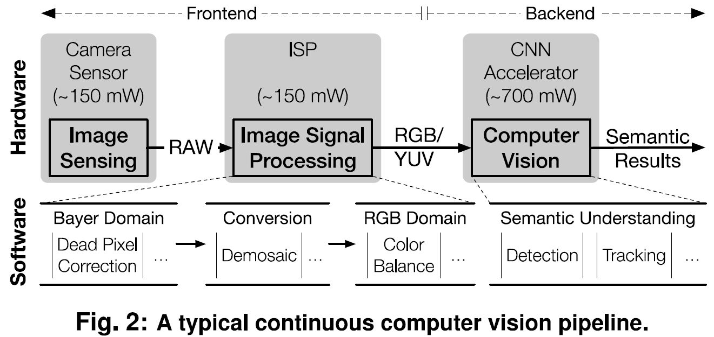

**Euphrates: Algorithm-SoC Co-Design for Low-Power Mobile Continuous Vision**

**Authors**

1.  **Yuhao Zhu** University of Rochester

2.  **Anand Samajdar** Georgia Institute of Technology

3.  **Matthew Mattina** ARM Research

4.  **Paul Whatmough** ARM Research

**Keywords:**

1.  Convolutional neural networks (CNN)

2.  Inference acceleration

3.  Low power, high energy efficiency, high performance

4.  Continuous vision application (Object Tracking, Object Detection)

5.  Motion information between consecutive frames

6.  Mobile SoC architecture design

7.  Algorithm-architecture co-design

8.  Software-hardware co-design

**Summary**

*Challenge*

Today’s continuous vision algorithms treat each frame as a standalone entity and
thus execute an entire CNN inference on every frame, which is
compute-inefficient and energy-inefficient in continuous vision application
(extracting high-level semantic information from real-time video streams such as
object detection and object tracking) and impractical on mobile computing
architecture because of limited compute capability under limited mobile power
budget.

Besides, A typical continuous computer vision pipeline consists of two parts: a
frontend and a backend, in which the frontend prepares pixel data for the
backend and the backend in turn extracts semantic information for high-level
decision making. However, most solutions treat these two parts as totally
independent steps, that means, the frontend and the backend are realized through
different IPs even through different chips designed by different manufactures,
causing that they share nothing but pure pixel data without further synergy.
This design method will introduce heavy bus data transmission and frequent CPU
interrupting, which is unsuitable for mobile computing architecture.

*Contributions*

This paper develops Euphrates, a proof-of-concept system of algorithm-SoC
co-designed approach. The main contributions of this paper are as follows:

1.  This paper proposes a new algorithm that leverages the temporal pixel motion
    to synthesize vision results on many frames with little computation while
    avoiding expensive CNN inferences, which improve compute efficiency of
    continuous vision with small accuracy loss.

2.  This paper designs the mobile SoC architecture to support new algorithm with
    two highlights. First, this paper greatly improves the compute efficiency by
    exploiting sharing motion data across the ISP and other IPS in a mobile SoC.
    Second, this paper proposes the *motion controller*, a new IP that
    autonomously coordinates the vision pipeline during CV tasks avoiding
    frequent CPU interrupting to save computing energy.

3.  This paper models a commercial mobile SoC, validated with hardware
    measurements and RTL implementations, and demonstrate significant energy
    savings with little accuracy loss.

*Experiments and Results*

This paper develops an in-house simulator with a methodology similar to the
GemDroid SoC simulator. The simulator includes a functional model, a performance
model, and a power model for evaluating the continuous vision pipeline. The
functional mode will derive accuracy results. The performance model captures the
timing behaviors of various vision pipeline components and the models the timing
of across-IP activities, from which this paper then tabulate SoC events that are
fed into the power model for energy estimation. This paper uses Tiny YOLO and
YOLOv2 for object detection experiment and MDNet for Object Tracking. The
results show that Euphrates achieves up to 66% SoC-level energy savings (4x for
the vision computations) with only 1% accuracy loss.

*Comments*

The goal of this paper is to improve the compute efficiency of continuous vision
with small accuracy loss, thereby enabling new mobile use cases. The key
contributions of this paper are not the proposed algorithm that uses emotion
information because there are already some similar algorithms proposed before.
This paper doesn’t focus on the detail architecture of any IP but delivers
readers an algorithm-architecture and hardware-software co-design approach to
save overall computing energy from a SoC-level perspective, which values most.
Besides, the simulator developed by this paper is very convincing and is worth
learning for our research. The only disadvantage of this paper is that it does
not detail the dataflow control and software design aspects.
