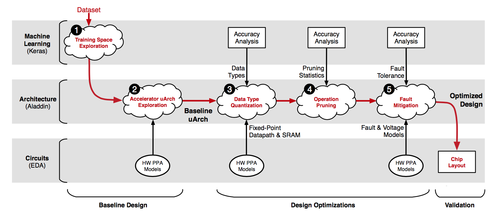

Minerva: Enabling Low-Power, Highly-Accurate Deep Neural Network Accelerators 
------------------------------------------------------------------------------

### Corresponding author

Brandon Reagen, Harvard University

David Brooks, Harvard University

### Keywords

Neural Network;

### Summary

#### Challenge

The continued success of Deep Neural Networks (DNNs) in classification tasks has
sparked a trend of accelerating their execution with specialized hardware. While
published de- signs easily give an order of magnitude improvement over
general-purpose hardware, few look beyond an initial implementation.

#### Contribution

This paper presents Minerva, a highly automated co-design approach across the
algorithm, architecture, and circuit levels to optimize DNN hardware
accelerators. The accelerator consists of **FIVE STAGEs**: 1) Training Space
Exploration. 2) Microarchitecture Design Space. 3) Data Type Quantization. 4)
Selective Operation Pruning. 5) SRAM Fault Mitigation.

**Stage 1: Training Space Exploration.** Minerva first establishes a fair DNN
baseline that achieves prediction accuracy comparable to state-of-the-art ML
results. This stage leverages the Keras software library to sweep the large DNN
hyperparameter space. Of the thousands of uniquely trained DNNs, Minerva selects
the network topology that minimizes error with reasonable resource requirements.

**Stage 2: Microarchitecture Design Space**. The optimal network from Stage 1 is
then fed to a second stage that thoroughly explores the accelerator design
space. This process exposes hardware resource trade-offs through
microarchitectural parameters (e.g., clock frequency and memory bandwidth).
Minerva then uses an optimal design point as the baseline implementation to
which all subsequent optimizations are applied and compared against.

**Stage 3: Data Type Quantization**. Minerva optimizes DNN data types with
linear quantization analysis, independently tuning the range and precision of
each DNN signal at each network layer. Quantization analysis minimizes bitwidths
without exceeding a strict prediction error bound. Compared to a 16 bit
fixed-point baseline, data type quantization reduces power consumption by 1.5×.

**Stage 4: Selective Operation Pruning**. The DNN kernel mostly comprises
repeated weight reads and MAC operations. Analysis of neuron activity values
reveals the vast majority of operands are close to zero. Minerva identifies
these neuron activities and removes them from the prediction computation such
that model accuracy is not affected. Selective pruning further reduces power
consumption by 2.0× on top of bitwidth quantization.

**Stage 5: SRAM Fault Mitigation**. By combining inherent algorithmic redundancy
with low overhead fault mitigation techniques, optimization Stage 5 saves an
additional 2.7× power by aggressively scaling SRAM supply voltages.

The first stage is **software level** acceleration and is examined using Keras.
The second to fifth stage belong to **architecture level** acceleration which
automates a large design space exploration of micro-architectural parameters
used for accelerator design. By using Aladdin, a simulation model is build.
Beyond there is also a **circuit level** acceleration using EDA to verify the
simulation result from software level and architecture level.

#### Result

Experiments show that these five-stage-optimization provide a collective average
of 8.1× power reduction over an accelerator baseline without compromising DNN
model accuracy.

Minerva enables highly accurate, ultra-low power DNN accelerators (in the range
of tens of milliwatts), making it feasible to deploy DNNs in power-constrained
IoT and mobile devices.
