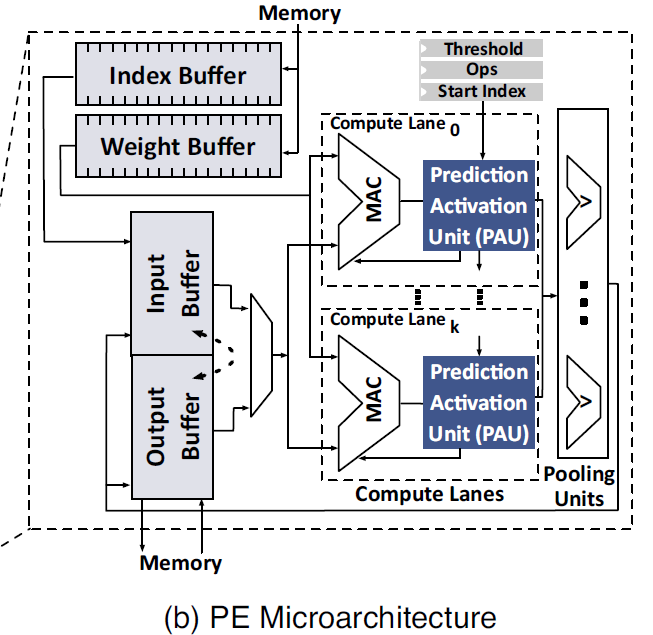

**SnaPEA: Predictive Early Activation for Reducing Computation in Deep
Convolutional Neural Networks**

**Authors**

1.  **Vahideh Akhlaghi** University of California, San Diego

2.  **Amir Yazdanbkhsh** Georgia Institute of Technology

3.  **Kambiz Samadi** Qualcomm Technologies

4.  **Rajesh K. Gupta** University of California, San Diego

5.  **Hadi Esmaeilzadeh** University of California, San Diego

**Keywords**

1.  Convolutional neural networks (CNN)

2.  Inference acceleration

3.  Predictive early activation

4.  Computation reduction

5.  Approximate computing

6.  Prediction algorithm

**Summary**

*Challenge*

In convolutional layers of many modern CNNs, each convolution operation is
commonly followed by an activation function called a Rectifying Linear Unit
(ReLU) that returns zero for negative inputs and yields the input itself for the
positive ones. If used properly, this unique algorithmic property could save a
large amount of computation, providing computing speedup and energy reduction.

*Contributions*

Harnessing this unique algorithmic property, this paper proposes SnaPEA, a
holistic software-hardware solution, that cuts a large fraction of the
computations short by identifying the zero intermediate values earlier during
the runtime. The main contributions of this paper are as follows:

1.  SnaPEA leverages the algorithmic structure of CNNs to reduce their
    computations. This paper provides an insight that amount of computation in
    CNNs can be significantly reduced by using a combination of runtime
    information along with the algorithmic structure of CNNs, which feeds many
    negative inputs to the activation function.

2.  SnaPEA is a runtime technique that cuts the CNN computation short. This
    paper devises an exact runtime approach that relies on a single-bit
    sign-check to cut the computation short without losing any accuracy. SnaPEA
    could operate in two distinct modes, named exact and predictive. The former
    doesn’t change classification accuracy, and the latter will navigate the
    trade-offs between the classification accuracy and computation reduction.

3.  SnaPEA provides hardware-software solution to control the accuracy
    trade-offs. This paper develops a multi-variable optimization algorithm that
    systematically thresholds the degree of speculation based on the sensitivity
    of the CNN output to each layer, which could control the
    accuracy-computation tradeoff.

*Experiments and Results*

This paper uses several popular medium to large scale dense CNN workloads, and
it also include SqueezeNet that maintains AlexNet-level accuracy with 50x fewer
parameters through a static pruning approach. This paper implements the
microarchitectural units of the proposed architecture in Verilog, and uses
Synopsys Design Compiler and a TSMC 45-nm standard-cell library to synthesize
the proposed architecture and obtain the area, delay, energy numbers of the
logic hardware unit. This paper chooses Eyeriss as baseline architecture, and
realize SnaPEA architecture with similar configurations.

This paper uses the synthesis results with TSMC 45-nm and reported numbers in
TETRIS, which uses the same technology node and has a similar PE architecture as
Eyeriss. This paper develops a cycle-level microarchitectural simulator that
closely model the architecture of Eyeriss and SnaPEA hardware to measure the
performance and energy savings of both hardware. This paper uses CACTI-P to
calculate the area and power of the register files and on-chip buffers. Finally,
the simulation will report the number of cycles and energy numbers for the whole
network.

The results show that Compared to a state-of-the-art CNN accelerator, SnaPEA in
the exact mode, yields, on average, 28% speedup and 16% energy reduction in
various modern CNNs without affecting their classification accuracy. With 3%
loss in classification accuracy, on average, 67.8% of the convolutional layers
can operate in the predictive mode. The average speedup and energy saving of
these layers are 2.02× and 1.89×, respectively. The benefits grow to a maximum
of 3.5 × speedup and 3.14× energy reduction. Compared to static pruning
approaches, which are

complimentary to the dynamic approach of SnaPEA, proposed technique offers up to
63% speedup and 49% energy reduction across the convolution layers with no loss
in classification accuracy.

*Comments*

Compared with other ISCA papers, the base idea of this paper is not very novel,
and the paper pay more attention on prediction algorithm and do relatively few
works on architecture design. However, compared with popular static pruning
approaches, this predictive early activation method could offer more speedup and
energy reduction with no loss in classification accuracy with a cost of
preprocessed model and specially designed hardware. And the tradeoffs between
classification accuracy and computation reduction need to be navigate carefully.
