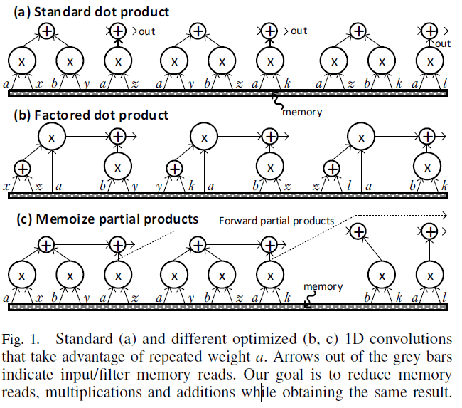

**UCNN: Exploiting Computational Reuse in Deep Neural Networks via Weight
Repetition**

**Authors**

1.  **Kartik Hegde** University of Illinois at Urbana-Champaign

2.  **Jiyong Yu** University of Illinois at Urbana-Champaign

3.  **Rohit Agrawal** University of Illinois at Urbana-Champaign

4.  **Mengjia Yan** University of Illinois at Urbana-Champaign

5.  **Michael Pelauer** NVIDIA

6.  **Christopher W. Fletcher** University of Illinois at Urbana-Champaign

**Keywords**

1.  Convolutional neural networks (CNN)

2.  Inference acceleration

3.  Weight repetition

4.  Weight sparsity

5.  Sub-computations optimization (dot products)

6.  Sparse accelerator

**Summary**

*Challenge*

CNN computations are made up of multi-dimensional dot products between weight
and input vectors. There is a characteristic, called *weight repetition*, that
the same weight occurs multiple times in or across weight vectors. This
characteristic could be exploited to save energy and improve performance during
CNN inference through formulation simplification. And this work generalizes a
popular line of work to improve efficiency from CNN weight sparsity.

*Contributions*

To exploit weight repetition, this paper proposes a new CNN accelerator called
the Unique Weight CNN Accelerator (UCNN), that uses weight repetition to reuse
CNN sub-computations (e.g., dot products) and to reduce CNN model size when
stored in off-chip DRAM – both of which save energy. The architecture is built
on two ideas: factorization and memorization, both of which are only possible
given repeated weights. Besides, reducing computation via weight repetition is
possible due to CNN filter design/weight quantization techniques and is inspired
by recent work on sparse CNN accelerators. The main contributions of this paper
are as follows:

1.  This paper introduces new techniques – including dot product factorization
    and activation group use – to improve CNN efficiency by exploiting weight
    repetition in and across CNN filters.

2.  This paper designs and implements a novel CNN accelerator, called UCNN, that
    improves performance and efficiency per dot product by using aforementioned
    techniques.

3.  This paper evaluate UCNN using an accelerator-level cycle and energy model
    as well as an RTL prototype of the UCNN processing element.

*Experiments and Results*

This evaluate UCNN using a whole-chip performance and energy model, and
design/synthesize the DCNN/UCNN Pes in RTL written in Verilog. All designs are
evaluated in a 32 nm process, assuming a 1GHz clock. Energy model is established
through multiple sources, such as CACTI and so on. This paper evaluates the
following design variants:

1.  DCNN: Baseline DCNN that does not exploit weight or activation sparsity, or
    weight repetition.

2.  DCNN_sp: DCNN with Eyeriss-style sparsity optimizations.

3.  UCNN_Uxx: UCNN, with all optimizations enabled except for the jump-style
    indirection table.

This paper evaluates the above schemes on three popular CNNs: a LeNet-like CNN,
AlexNet and ResNet-50. The results show that UCNN improves throughput normalized
energy consumption by 1.2× ∼ 4×, relative to a similarly provisioned baseline
accelerator that uses Eyeriss-style sparsity optimizations. At the same time,
the UCNN processing element adds only 17-24% area overhead relative to the same
baseline.

*Comments*

This paper delivers a brand-new way to reuse data through sub-computation
optimizations based on the idea of weight repetition. This method could work
well cooperated with weight quantization, and it could also compete with sparse
accelerators. However, just like other sparse accelerators, the UCNN couldn’t
bring performance speedup although it could improve energy efficiency. Besides,
the dataflow of computation is irregular, which means the dataflow control and
the weight arrangement should be treated carefully, however this paper doesn’t
give more details. Finally, compared with baseline, the overhead of UCNN
processing element is a little high, and the preprocess of model file will be
complicated. Anyway, this paper has taken a step forward towards generalizing
sparse architectures, worth pursuing.
