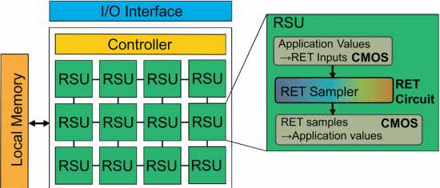

Accelerating Markov Random Field Inference Using Molecular Optical Gibbs
Sampling Units

Corresponding author

Siyang Wang ; Xiangyu Zhang ; Yuxuan Li ; Ramin Bashizade ; Song Yang ; Chris
Dwyer ; Alvin R. Lebeck

Duke University

Keywords

Bayes methods, graphics processing units, inference mechanisms, iterative
methods, learning (artificial intelligence), Markov processes, Monte Carlo
methods, random processes, statistical distributions

新器件; 模拟器件; 物理模拟

Summary

*Challenge*

Many approaches in statistics and machine learning utilize probabilistic
algorithms that **generate samples from parameterized probability
distributions** (e.g., exponential distribution with a decay rate). Markov
Random Field (MRF) Bayesian Inference can be used for a broad class of
applications, including image processing (e.g., image segmentation, motion
estimation, stereo vision, texture modeling), associative memory, etc. The
overall goal of a specified MRF model is often to determine the most likely
value for each random variable given the observed data, achieved in Markov Chain
Monte Carlo (MCMC) sampling by iteratively sampling the random variables
according to the conditional dependencies and then identifying the mode of the
generated samples. However, **MCMC becomes inefficient** for many inference
problems in practice, especially those with high dimensionality (many random
variables) and complex structure. MCMC can **require many iterations to
converge** to a solution and the inner loop incurs the overhead of sample
generation from prescribed distributions.

*Contribution*

To be concluded, the authors proposed **a new hardware based on physical
process** to generate specific random variable from a parameterized
distributions in a high speed, which meets the need of certain probabilistic
algorithms.

To solve the MCMC problem, the authors proposed a new hardware using physical
device to supports a wide variety of probabilistic algorithms. This paper
exploit the physical properties of molecular-scale optical devices. The authors
build on recent work that provides a theoretical foundation for creating novel
probabilistic functional units based on **Resonance Energy Transfer** (RET) that
can approximate virtually arbitrary probabilistic behavior and generate samples
from general distributions. Further, the authors introduce the concept of a
RET-based Sampling Unit (RSU), a **hybrid CMOS/RET functional unit** that
generates samples from parameterized distributions. An RSU specializes the
calculation of distribution parameters in CMOS and uses RET to **generate
samples from a parameterized distribution in only a few nanoseconds**. To
accelerate MRF inference using MCMC, authors introduce RSU-G, **a Gibbs Sampling
unit** based on the ‘first-to-fire’ exponential unit. Our specific RSU-G unit
supports first-order MRFs with a smoothness-based prior, which includes many
image processing applications (e.g., image segmentation, motion estimation,
stereo vision).

Such RSU can be integrated into GPU, or used as a discrete accelerator.

*Result*

The simulations shows that a GPU augmented with RSU-G units can achieve
**speedups of up to 3 and 16** for image segmentation and motion estimation,
respectively. A discrete accelerator with 336 RSU-G units achieves speedups of
21 and 54 assuming a 336GB/s memory BW limitation. The novel optical components
of RSU-G units consume very little power (0.16 mW) and area (0.0016 mm2).
Synthesizing the CMOS portions of RSU-G in 15nm reveals power of 3.75 mWand area
of 0.0013 mm2 for a total RSU-G power of 3.91 mW and area of 0.0029 mm2.

*Comments*

The hardware is some sort of True Random Generator, which generate random number
from physical process. The idea of using a physical process to accelerate
time-costing step in certain algorithms is attractive, but such unit are
therefore limited to this class of algorithms. The device is not significantly
related to neural networks.
